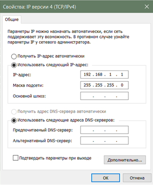
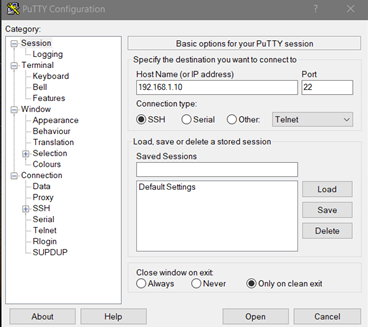
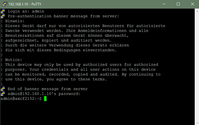
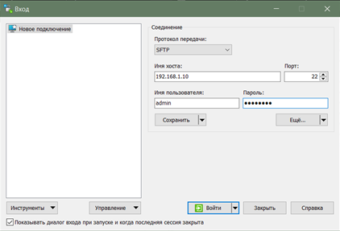
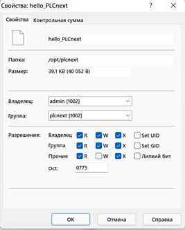
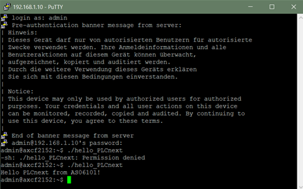

Министерство образования Республики Беларусь

Учреждение образования

“Брестский Государственный технический университет”

Кафедра ИИТ

   

Лабораторная работа №3

По дисциплине “Теория и методы автоматического управления”

Тема: “Работа с контроллером AXC F 2152”

   

Выполнил:

Студент 3 курса

Группы АС-61

Баюн Н.О.

Проверил:

Старший преподаватель

Иванюк Д.С.

   

Брест 2023

---

# Цель работы: 

Cоздать тестовый проект "Hello PLCnext from AS0xxyy!", собрать его и продемонстрировать работоспособность на тестовом контроллере.

# Задание: [#3](../../../../tasks/task_03/readme.md).

# Ход работы:

Для решения задачи нам необходимо собрать hello_PLCnext в Visual Studio.

<li>
Подключаемся к контроллеру в лабаратории, настраиваем сеть.
</li>

  

<li>
Далее открываем программу PuTTY Configuration и подключаемся к контроллеру.
</li>

 

<li>
Вводим login и password для подключения к контроллеру, затем открываем WinCP и подключаемся к контроллеру.
</li>

 

 

<li>
В корень контролера добавляем собраный проект и для запуска меняем его разрешения.
</li>

 

<li>
Запускаем проект 
</li>

 

 
