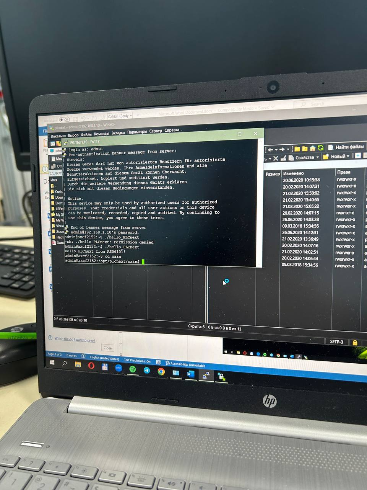

Министерство образования Республики Беларусь

Учреждение образования

“Брестский Государственный технический университет”

Кафедра ИИТ

   

Лабораторная работа №3

По дисциплине “Теория и методы автоматического управления”

Тема: “Работа с контроллером AXC F 2152”

   

Выполнил:

Студент 3 курса

Группы АС-61

Баюн Н.О.

Проверил:

Старший преподаватель

Иванюк Д.С.

   

Брест 2023

---

# Цель работы: 

Cоздать тестовый проект "Hello PLCnext from AS0xxyy!", собрать его и продемонстрировать работоспособность на тестовом контроллере.

# Задание:
1. Ознакомиться с общей информацией о платформе PLCnext.
2. Изучить руководство.
3. Используя Visual Code создать тестовый проект "Hello PLCnext from AS0xxyy!", собрать его и продемонстрировать работоспособность на тестовом контроллере.
4. Написать отчет по выполненной работе в .md формате (readme.md) и с помощью pull request разместить его в следующем каталоге: trunk\as000xxyy\task_03\doc.

# Ход работы:

Для решения задачи необходимо собрать hello_PLCnext в Visual Studio.

В лаборатории подключаемся к контроллеру и настраиваем сеть.

  

Далее открываем программу PuTTY Configuration и подключаемся к контроллеру.

 

Вводим логин и пароль для подключения к контроллеру.

 

Открываем программу WinCP и подключаемся к контроллеру.

 

Добавляем собраный проект в корень контролера и для запуска меняем его разрешения.

 

Запускаем наш проект и получаем следующий вывод.

 

 