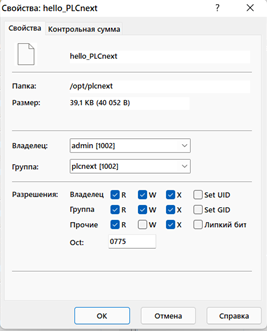

 Министерство образования Республики Беларусь 

Учреждение образования 

  “Брестский Государственный технический университет” 

 Кафедра ИИТ

   

 Лабораторная работа №4

 По дисциплине “Теория и методы автоматического управления”

 Тема: “Работа с контроллером AXC F 2152”

   

 Выполнил:

 Студент 3 курса

 Группы АС-61

 Баюн Н.О.

 Проверил:

Старший преподаватель

Иванюк Д.С.

   

Брест 2023

### <em> Цель работы: </em> 
Используя платформу Visual Studio собрать проект ptusa_main и продемонстрировать работоспособность на тестовом контроллере.
 

### <em> Задание: </em>  [4](../../../../tasks/task_04/readme.md)

### 
 <em> Ход работы: </em> 

• В первую очередь клонирую репозиторий ptusa_main. Далее открываю этот репозиторий и получаю проект на основе CMake. 

• Проект собираю с помощью Visual Studio и затем, как мы делали в 3 лабараторной работе, подключаюсь к контроллеру.

• После этого,для запуска исполняемого файла, изменяю права доступа:

 • А для запуска исполняемого файла использую команду:

./ptusa_main  main.plua  sys_path  ./sys/ 

• Результат и фотография из лаборатории: 

### <em> Вывод по работе: </em>
В ходе лабораторной работы научились собирать нужный нам прокт с помощью Visual Studio и показали на тестовом контроллере его работоспособность..
