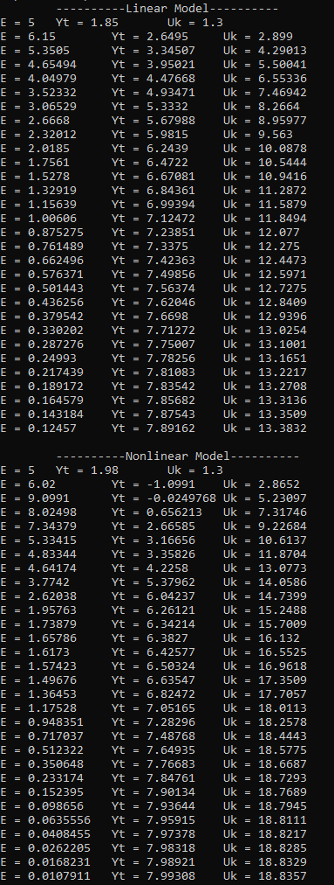
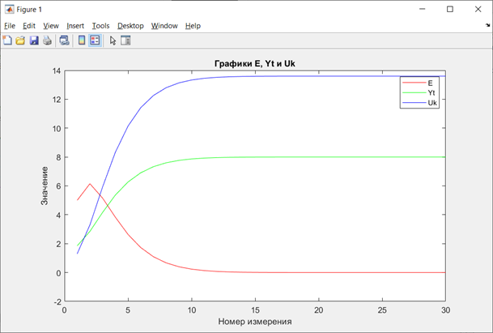
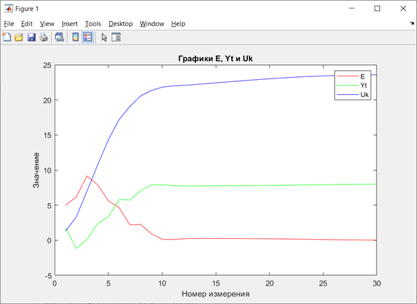

 Министерство образования Республики Беларусь
 Учреждение образования
 “Брестский Государственный технический университет”
 Кафедра ИИТ

   

Лабораторная работа <em>№2</em>
 По дисциплине “Теория и методы автоматического управления”
 Тема: <em>“Пид-регуляторы”</em>

   

<strong>Выполнил:</strong>
 Студент 3 курса
 Группы АС-61
 <em>Василенко И.В.</em>

 

<strong>Проверил:</strong>
 Старший преподаватель
 <em>Иванюк Д.С.</em>

   

<strong>Брест 2023</strong>

---
**Цель:** на *C++* реализовать программу, моделирующую *ПИД-регулятор*. В качестве объекта управления использовать математическую модель, полученную в предыдущей работе. Использовать *ООП*, в программе должно быть не менее *3-х классов (+наследование)*. В отчете также привести *графики* для разных заданий температуры объекта, пояснить полученные результаты (отчет получать с помощью *Doxygen* в *.md* формате).

**Задание:** текст задания к лабораторной работе представлен в файле [***#2***](../../../../tasks/task_02/readme.md).

**Решение:**

- Следуя заданию, на языке программирования *C++*, с использованием *ООП*, была реализована программа, моделирующую *ПИД-регулятор*. 

- Код программы представлен в файле [***main.cpp***](../src/main.cpp).

- С помощью программы *Doxygen* ( *Doxygen* - это инструмент, который позволяет автоматически генерировать документацию из аннотированных исходных кодов на разных языках программирования, таких как *C++, C, Java, Python* и других) была создана документация нашей программы в формате *.md*, которая представленна в файле [***doxygen.md***](doxygen.md).

- После запуска нашей программы мы получаем следующий вывод данных на консоль:

**Вывод нашей программы на консоль:**

 

- На основе данных, полученных при запуске нашей программы, были построены (с помощью приложения *matlab*) графики линейной и нелинейной модели:

**Графики:**

- **Линейная модель:**

 

- **Нелинейная модель:**

 

**Вывод:** В данной лабораторной работе была реализована программа на языке программирования *C++*, моделирующая *ПИД-регулятор* для управления температурой объекта. Для этого была использована математическая модель объекта, полученная в предыдущей работе. Программа была написана с использованием ООП. 

Программа позволяет задавать различные параметры регулятора и объекта, а также желаемую температуру. Результаты работы программы были визуализированы с помощью графиков, показывающих динамику изменения температуры объекта и управляющего сигнала в зависимости от времени. Графики были получены с помощью пакета прикладных программ для решения задач технических вычислений *matlab*.

Из графиков видно, что *ПИД-регулятор* обеспечивает быстрое и точное достижение заданной температуры, а также устойчивость к внешним воздействиям. Отчет о выполнении работы был сгенерирован с помощью программы *Doxygen* в формате *.md*, содержащем подробное описание программы, ее структуры и использованных алгоритмов.

Такие работы очень важны для развития навыков программирования и документации, потому что они позволяют использовать инструменты, такие как *Doxygen*, которые автоматически генерируют документацию из аннотированных исходных кодов на разных языках программирования.
