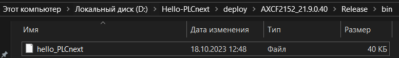
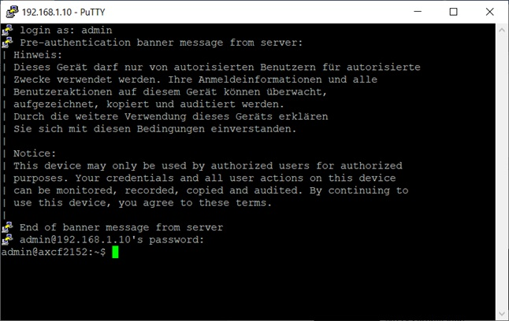
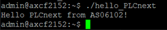
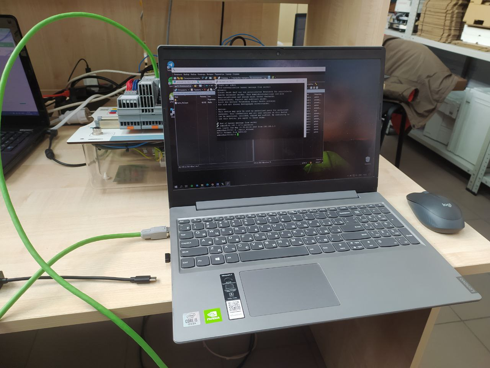

<p align="center"> Министерство образования Республики Беларусь</p>
<p align="center">Учреждение образования</p>
<p align="center">“Брестский Государственный технический университет”</p>
<p align="center">Кафедра ИИТ</p>
<br><br><br>
<p align="center">Лабораторная работа №3</p>
<p align="center">По дисциплине “Теория и методы автоматического управления”</p>
<p align="center">Тема: “Работа с контроллером AXC F 2152”</p>
<br><br><br>
<p align="right">Выполнил:</p>
<p align="right">Студент 3 курса</p>
<p align="right">Группы АС-61</p>
<p align="right">Василенко И.В.</p>
<p align="right">Проверил:</p>
<p align="right">Старший преподаватель</p>
<p align="right">Иванюк Д.С.</p>
<br><br><br>
<p align="center">Брест 2023</p>

---
<p> <strong>Цель:</strong> создать тестовый проект "Hello PLCnext from AS0xxyy!", собрать его и продемонстрировать работоспособность на тестовом контроллере.</p> 

Задание: [#3](../../../../tasks/task_03/readme.md).
<p> <strong>Решение:</strong> </p>
<p>Следуя заданию, клонируем репозиторий. Изменяем файл формата <em>.json</em> в зависимости от версии нужных нам программ и их расположения. </p>
<p>Собираем файл <em>hello_PLCnext</em> используя следующие команды:</p>


 ``` bash
cmake --preset=build-windows-AXCF2152-2021.9.0.40 .
```


 ``` bash
cmake --build --preset=build-windows-AXCF2152-2021.9.0.40 --target all .
```


 ``` bash
cmake --build --preset=build-windows-AXCF2152-2021.9.0.40 --target install .
```

<p>Получаем файл <em></em>hello_PLCnext.</p>

  

<p>В лаборатории подключаемся к контроллеру.</p>
<p>Настраиваем сеть.</p>

  

<p>Проверяем подключение к контроллеру.</p>

  

<p>Открываем программу <em>PuTTY Configuration</em> и подключаемся к контроллеру.</p>

 

<p>Вводим логин и пароль для подключенияя к контроллеру.</p>

 

<p>Открываем программу <em>WinCP</em> и подключаемся к контроллеру.</p>

 

<p>Добавляем собраный проект в корень контролера и меняем его разрешения, для запуска.</p>

 

<p>Запускаем наш проект. И получаем следующий вывод.</p>

 

 

<p> <strong> Вывод:</strong> В ходе выполнения данной лабораторной работы были получены знания для работы с контроллером <em>AXC F 2152</em>.</p>
