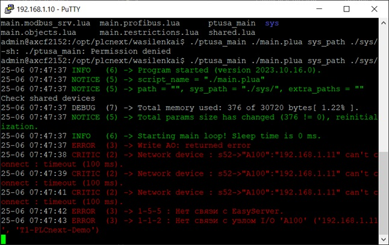
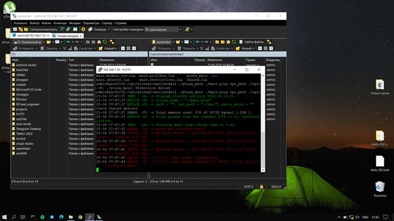

<p align="center"> Министерство образования Республики Беларусь</p>
<p align="center">Учреждение образования</p>
<p align="center">“Брестский Государственный технический университет”</p>
<p align="center">Кафедра ИИТ</p>
<br><br><br>
<p align="center">Лабораторная работа №4</p>
<p align="center">По дисциплине “Теория и методы автоматического управления”</p>
<p align="center">Тема: “Работа с контроллером AXC F 2152”</p>
<br><br><br>
<p align="right">Выполнил:</p>
<p align="right">Студент 3 курса</p>
<p align="right">Группы АС-61</p>
<p align="right">Василенко И.В.</p>
<p align="right">Проверил:</p>
<p align="right">Старший преподаватель</p>
<p align="right">Иванюк Д.С.</p>
<br><br><br>
<p align="center">Брест 2023</p>

---
<p> <strong>Цель:</strong>используя <em>Visual Studio</em> собрать данный проект и продемонстрировать работоспособность на тестовом контроллере.</p> 

Задание: [#4](../../../../tasks/task_04/readme.md).
<p> <strong>Решение:</strong> </p>

По заданию, клонируем репозиторий [ptusa_main](https://github.com/savushkin-r-d/ptusa_main).

<p>Открываем данный репозиторий (в <em>Visual Studio</em>). Таким образом, мы получаем проект на основе <em>CMake</em>.</p>
<p>Используя <em>Visual Studio</em> собраем данный проект.</p>
<p>Далее подключаемся к контроллеру так же как и в <em>3 лабораторной работе:</em> </p>

[task_03](../../task_03/doc/readme.md).

<p>Переходим в папку с проектом и запускаем нашу программу:</p>

``` bash

./ptusa_main  main.plua  sys_path  ./sys/

```

<p>Получаем следуюий вывод на консоль: </p>






<p> <strong> Вывод:</strong> в ходе выполнения данной лабораторной работы были получены знания работы в среде разработки <em>Visual Studio</em>, а также был собран проект и получены дополнительные навыки работы на тестовым контроллером <em>AXC F 2152</em>.</p>
