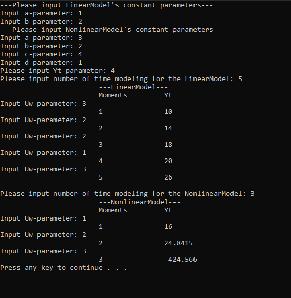

# Laboratory work №.1              
<p align="center">MINISTRY OF EDUCATION OF THE REPUBLIC OF BELARUS</p>
<p align="center">EDUCATIONAL INSTITUTION</p>
<p align="center">«BREST STATE TECHNICAL UNIVERSITY»</p>       
<p align="center">Department of IIT</p>
<br><br><br><br>
<p align="center">Laboratory work №.1</p>
<br><br><br>
<p align="right">Completed by the 3rd year student of</p> 
<p align="right">the Faculty of Electronic Information Systems</p>
<p align="right">the group AC-61 Dzibuk A.V.</p>
<p align="right">Checked by Ivanuk D.S.</p>
<br><br><br>
<p align="center">Brest 2023</p>

---

## Task 1. Modeling controlled object :
 
Write program (C++), which simulate object temperature.

### Realization
There are two classes in the program:

1. LinearModel represents linear model.
2. NonlinearModel represents nonlinear model.

<p align="center" style="font-size:25px;font-weight: bold">
RESULTS</p>

<p align="center"></p>

### How to build the project?

1. The first you need to clone this repository to your computer.

2. Go to the folder "trunk\as0006104\task_01\src".

3. Run the command line and type 6 commands :

```console 
mkdir build
cd build
cmake ..
cmake --build .
cd MainFile\Debug
.\Main.exe
```


