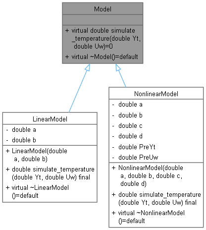
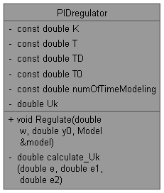

# Summary

 Members                        | Descriptions                                
--------------------------------|---------------------------------------------
`class `[`LinearModel`](#class_linear_model) | Linear model of temperature control.
`class `[`Model`](#class_model) | An abstract model's class.
`class `[`NonlinearModel`](#class_nonlinear_model) | Nonlinear model of temperature control.
`class `[`PIDregulator`](#class_p_i_dregulator) | Proportional–integral–derivative regulator.

# class `LinearModel` 

```
class LinearModel
  : public Model
```  

Linear model of temperature control.

## Summary

 Members                        | Descriptions                                
--------------------------------|---------------------------------------------
`public inline  `[`LinearModel`](#class_linear_model_1a354c216624723c40fa18004290d97941)`(double a,double b)` | Construct a new [LinearModel](#class_linear_model) object.
`public inline virtual double `[`simulate_temperature`](#class_linear_model_1a4f7bb9064ad7490ab43980ac00a392be)`(double Yt,double Uw)` | This is a redefined method for calculating the output temperature of a linear model object.
`public virtual  `[`~LinearModel`](#class_linear_model_1a37b91fcf8384e576cf874c34bd58fc24)`() = default` | Destroy the [LinearModel](#class_linear_model) object.
`private double `[`a`](#class_linear_model_1ad1c29ddadacd1fe5bd0440d8baca21d7) | Parametr a.
`private double `[`b`](#class_linear_model_1a8e0bce9ea83faf2e1de914875545ef88) | Parametr b.

## Members

#### `public inline  `[`LinearModel`](#class_linear_model_1a354c216624723c40fa18004290d97941)`(double a,double b)` 

Construct a new [LinearModel](#class_linear_model) object.

#### Parameters
* `a` `b` some constants

#### `public inline virtual double `[`simulate_temperature`](#class_linear_model_1a4f7bb9064ad7490ab43980ac00a392be)`(double Yt,double Uw)` 

This is a redefined method for calculating the output temperature of a linear model object.

#### `public virtual  `[`~LinearModel`](#class_linear_model_1a37b91fcf8384e576cf874c34bd58fc24)`() = default` 

Destroy the [LinearModel](#class_linear_model) object.

#### `private double `[`a`](#class_linear_model_1ad1c29ddadacd1fe5bd0440d8baca21d7) 

Parametr a.

#### `private double `[`b`](#class_linear_model_1a8e0bce9ea83faf2e1de914875545ef88) 

Parametr b.

# class `Model` 

An abstract model's class.

[Model](#class_model) is used to represent other models.

## Summary

 Members                        | Descriptions                                
--------------------------------|---------------------------------------------
`public double `[`simulate_temperature`](#class_model_1a5a90c717f9a81a28dc7c01e83d60c507)`(double Yt,double Uw)` | Virtual function for temperature determination.
`public virtual  `[`~Model`](#class_model_1a2efbe4ec768191fa70ad86f260ec2fd6)`() = default` | Destroy the model object.

## Members

#### `public double `[`simulate_temperature`](#class_model_1a5a90c717f9a81a28dc7c01e83d60c507)`(double Yt,double Uw)` 

Virtual function for temperature determination.

#### Parameters
* `Yt` input temperature 

* `Uw` input warm 

#### Returns
double output temperature

#### `public virtual  `[`~Model`](#class_model_1a2efbe4ec768191fa70ad86f260ec2fd6)`() = default` 

Destroy the model object.

# class `NonlinearModel` 

```
class NonlinearModel
  : public Model
```  

Nonlinear model of temperature control.

## Summary

 Members                        | Descriptions                                
--------------------------------|---------------------------------------------
`public inline  `[`NonlinearModel`](#class_nonlinear_model_1a9f3a611ca0c92ff58940e6c17e2ee55d)`(double a,double b,double c,double d)` | Construct a new [NonlinearModel](#class_nonlinear_model) object.
`public inline virtual double `[`simulate_temperature`](#class_nonlinear_model_1a5fc532df0aa33e129ce6721d536922bf)`(double Yt,double Uw)` | This is a redefined method for calculating the output temperature of a nonlinear model object.
`public virtual  `[`~NonlinearModel`](#class_nonlinear_model_1ae267221772fc580efedbef866a92a1b1)`() = default` | Destroy the [NonlinearModel](#class_nonlinear_model) object.
`private double `[`a`](#class_nonlinear_model_1af1c74b613ca790cdda544b0ca3e13cb0) | Parametr a.
`private double `[`b`](#class_nonlinear_model_1a271d228355d448b5c52dce540ef69898) | Parametr b.
`private double `[`c`](#class_nonlinear_model_1ac58220681e73f7cf9e819b8b30d07a00) | Parametr c.
`private double `[`d`](#class_nonlinear_model_1a60542abc380c49c3fa5558a62579576f) | Parametr d
`private double `[`PreYt`](#class_nonlinear_model_1afb44c15c8470524681ab4a96334bf937) | Previous temperature value.
`private double `[`PreUw`](#class_nonlinear_model_1a45037db07192e3c82a2163d171c002c9) | Previous warm value.

## Members

#### `public inline  `[`NonlinearModel`](#class_nonlinear_model_1a9f3a611ca0c92ff58940e6c17e2ee55d)`(double a,double b,double c,double d)` 

Construct a new [NonlinearModel](#class_nonlinear_model) object.

#### Parameters
* `a` `b` `c` `d` some constants

#### `public inline virtual double `[`simulate_temperature`](#class_nonlinear_model_1a5fc532df0aa33e129ce6721d536922bf)`(double Yt,double Uw)` 

This is a redefined method for calculating the output temperature of a nonlinear model object.

#### `public virtual  `[`~NonlinearModel`](#class_nonlinear_model_1ae267221772fc580efedbef866a92a1b1)`() = default` 

Destroy the [NonlinearModel](#class_nonlinear_model) object.

#### `private double `[`a`](#class_nonlinear_model_1af1c74b613ca790cdda544b0ca3e13cb0) 

Parametr a.

#### `private double `[`b`](#class_nonlinear_model_1a271d228355d448b5c52dce540ef69898) 

Parametr b.

#### `private double `[`c`](#class_nonlinear_model_1ac58220681e73f7cf9e819b8b30d07a00) 

Parametr c.

#### `private double `[`d`](#class_nonlinear_model_1a60542abc380c49c3fa5558a62579576f) 

Parametr d

#### `private double `[`PreYt`](#class_nonlinear_model_1afb44c15c8470524681ab4a96334bf937) 

Previous temperature value.

#### `private double `[`PreUw`](#class_nonlinear_model_1a45037db07192e3c82a2163d171c002c9) 

Previous warm value.

# class `PIDregulator` 

Proportional–integral–derivative regulator.

## Summary

 Members                        | Descriptions                                
--------------------------------|---------------------------------------------
`public inline void `[`Regulate`](#class_p_i_dregulator_1a237cb281c5134ada08cee584ac6cfb2b)`(double w,double y0,`[`Model`](#class_model)` & model)` | Modeling regulator.
`private const double `[`K`](#class_p_i_dregulator_1a0662b7bf934444667649c14086f299c7) | Transfer coefficient.
`private const double `[`T`](#class_p_i_dregulator_1ab778b871c7d009fcb3106e05073cd7ca) | Integration constant.
`private const double `[`TD`](#class_p_i_dregulator_1ae4e1c1b2e61f4f64bd48310937b059c8) | Differentiation constant.
`private const double `[`T0`](#class_p_i_dregulator_1a16035e1bc023b64a518ad4bee9d91b14) | Quantization step.
`private const double `[`numOfTimeModeling`](#class_p_i_dregulator_1a621ad60a30ce0526c479b42b51c5fd43) | Simulation time.
`private double `[`Uk`](#class_p_i_dregulator_1abb293000d9ac7ba842434418998c6ced) | Control variable value.
`private inline double `[`calculate_Uk`](#class_p_i_dregulator_1a4dbcf92693b3c7052e48305919ed1e29)`(double e,double e1,double e2)` | Calculate current control value.

## Members

#### `public inline void `[`Regulate`](#class_p_i_dregulator_1a237cb281c5134ada08cee584ac6cfb2b)`(double w,double y0,`[`Model`](#class_model)` & model)` 

Modeling regulator.

#### Parameters
* `w` desired value 

* `y0` initial temperature 

* `model` linear or nonlinear model

#### `private const double `[`K`](#class_p_i_dregulator_1a0662b7bf934444667649c14086f299c7) 

Transfer coefficient.

#### `private const double `[`T`](#class_p_i_dregulator_1ab778b871c7d009fcb3106e05073cd7ca) 

Integration constant.

#### `private const double `[`TD`](#class_p_i_dregulator_1ae4e1c1b2e61f4f64bd48310937b059c8) 

Differentiation constant.

#### `private const double `[`T0`](#class_p_i_dregulator_1a16035e1bc023b64a518ad4bee9d91b14) 

Quantization step.

#### `private const double `[`numOfTimeModeling`](#class_p_i_dregulator_1a621ad60a30ce0526c479b42b51c5fd43) 

Simulation time.

#### `private double `[`Uk`](#class_p_i_dregulator_1abb293000d9ac7ba842434418998c6ced) 

Control variable value.

#### `private inline double `[`calculate_Uk`](#class_p_i_dregulator_1a4dbcf92693b3c7052e48305919ed1e29)`(double e,double e1,double e2)` 

Calculate current control value.

#### Parameters
* `e` deviation from the desired value 

* `e1` previous deviation from the desired value 

* `e2` previous deviation from e1 

#### Returns
double updated control variable value

## Class diagram

<p align="center">


</p>