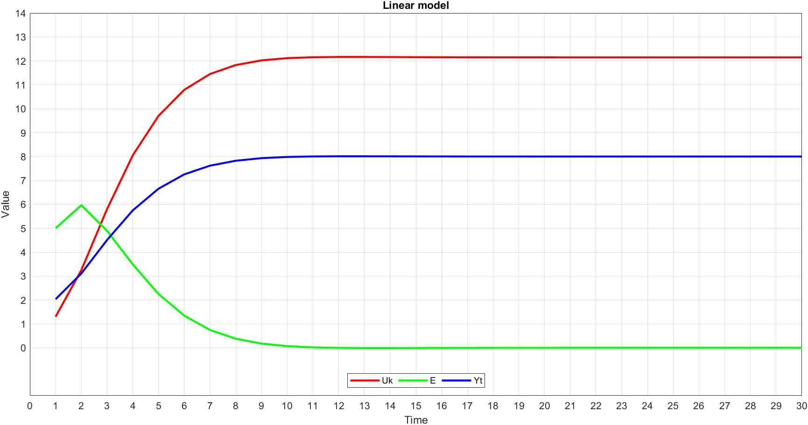
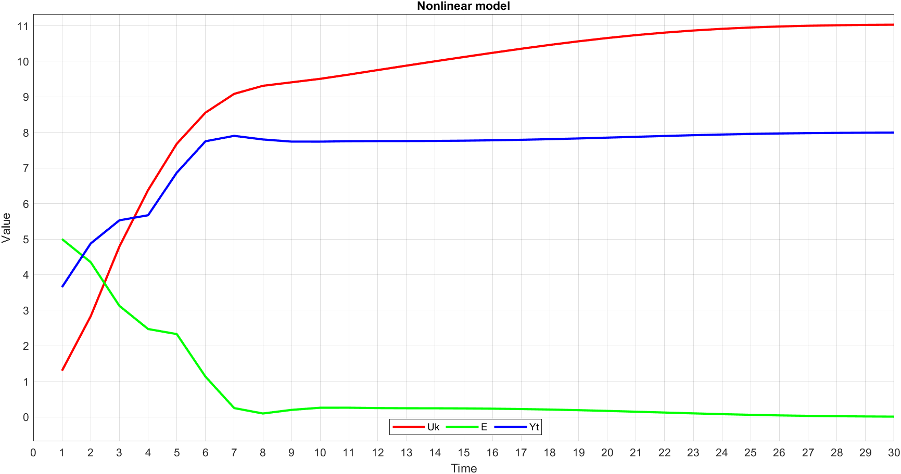

<p align="center">MINISTRY OF EDUCATION OF THE REPUBLIC OF BELARUS</p>
<p align="center">EDUCATIONAL INSTITUTION</p>
<p align="center">«BREST STATE TECHNICAL UNIVERSITY»</p>       
<p align="center">Department of IIT</p>
<br><br><br><br>
<p align="center">Laboratory work №.2</p>
<br><br><br>
<p align="right">Completed by the 3rd year student of</p> 
<p align="right">the Faculty of Electronic Information Systems</p>
<p align="right">the group AC-61 Dzibuk A.V.</p>
<p align="right">Checked by Ivanuk D.S.</p>
<br><br><br>
<p align="center">Brest 2023</p>

---

## Task 2. PID-regulators :
 
On C++ to implement the program simulating the reviewed PID-regulator. Use the mathematical model obtained in the previous task as a control object. Use OOP, the program must have at least 3 classes (+inheritance). Provide graphs for different parameters of the temperature of the object, explain the results (the report is obtained using Doxygen in .md format).


### Realization
There are 4 classes in the program:
1. Model is an abstract model. 
2. LinearModel represents linear model.
3. NonlinearModel represents nonlinear model.
4. PIDregulator.

The following values were set for the PID-regulator: __K = 0.1 , T = 10, TD = 80, T0 = 50__ 
<p align="center" style="font-size:25px;font-weight: bold">
Output of the program</p>

```console
---Please input LinearModel's constant parameters---
Input a-parameter: 0.44
Input b-parameter: 0.55
---Please input NonlinearModel's constant parameters---
Input a-parameter: 1
Input b-parameter: 0.022
Input c-parameter: 0.5
Input d-parameter: 0.5
        ---LinearModel---
E = 5, Yt = 2.035, Uk = 1.3
E = 5.965, Yt = 3.10799, Uk = 3.2509
E = 4.89201, Yt = 4.51001, Uk = 5.80002
E = 3.48999, Yt = 5.74925, Uk = 8.05318
E = 2.25075, Yt = 6.65516, Uk = 9.70029
E = 1.34484, Yt = 7.25363, Uk = 10.7884
E = 0.746374, Yt = 7.6176, Uk = 11.4502
E = 0.382404, Yt = 7.82347, Uk = 11.8245
E = 0.176534, Yt = 7.93122, Uk = 12.0204
E = 0.0687828, Yt = 7.98247, Uk = 12.1136
E = 0.0175278, Yt = 8.00354, Uk = 12.1519
E = -0.00354008, Yt = 8.00986, Uk = 12.1634
E = -0.00985796, Yt = 8.00983, Uk = 12.1633
E = -0.00983495, Yt = 8.00768, Uk = 12.1594
E = -0.00768328, Yt = 8.00528, Uk = 12.1551
E = -0.00528433, Yt = 8.00333, Uk = 12.1515
E = -0.00332513, Yt = 8.00194, Uk = 12.149
E = -0.001941, Yt = 8.00105, Uk = 12.1474
E = -0.00105211, Yt = 8.00052, Uk = 12.1464
E = -0.000523642, Yt = 8.00023, Uk = 12.1459
E = -0.00023166, Yt = 8.00008, Uk = 12.1456
E = -8.29071e-05, Yt = 8.00001, Uk = 12.1455
E = -1.47779e-05, Yt = 7.99999, Uk = 12.1454
E = 1.13694e-05, Yt = 7.99998, Uk = 12.1454
E = 1.76896e-05, Yt = 7.99998, Uk = 12.1454
E = 1.59602e-05, Yt = 7.99999, Uk = 12.1454
E = 1.1899e-05, Yt = 7.99999, Uk = 12.1454
E = 7.93855e-06, Yt = 8, Uk = 12.1454
E = 4.87528e-06, Yt = 8, Uk = 12.1454
E = 2.7817e-06, Yt = 8, Uk = 12.1455

        ---NonlinearModel---
E = 5, Yt = 3.65, Uk = 1.3
E = 4.35, Yt = 4.69928, Uk = 2.831
E = 3.30072, Yt = 5.37341, Uk = 4.83719
E = 2.62659, Yt = 5.54597, Uk = 6.48016
E = 2.45403, Yt = 6.82808, Uk = 7.85645
E = 1.17192, Yt = 7.69086, Uk = 8.77773
E = 0.309137, Yt = 7.77567, Uk = 9.3445
E = 0.224331, Yt = 7.64963, Uk = 9.61507
E = 0.350372, Yt = 7.59421, Uk = 9.77357
E = 0.405785, Yt = 7.60262, Uk = 9.943
E = 0.397383, Yt = 7.62175, Uk = 10.1348
E = 0.378247, Yt = 7.64101, Uk = 10.3299
E = 0.35899, Yt = 7.66729, Uk = 10.5171
E = 0.332711, Yt = 7.70457, Uk = 10.6928
E = 0.295433, Yt = 7.75159, Uk = 10.8537
E = 0.248414, Yt = 7.8046, Uk = 10.9951
E = 0.195402, Yt = 7.85855, Uk = 11.1131
E = 0.141453, Yt = 7.90807, Uk = 11.2053
E = 0.0919258, Yt = 7.94882, Uk = 11.2717
E = 0.0511831, Yt = 7.97846, Uk = 11.315
E = 0.021542, Yt = 7.99701, Uk = 11.3394
E = 0.00298894, Yt = 8.00633, Uk = 11.3501
E = -0.00632886, Yt = 8.00918, Uk = 11.3522
E = -0.00917776, Yt = 8.00833, Uk = 11.3497
E = -0.00832575, Yt = 8.00595, Uk = 11.3458
E = -0.00594996, Yt = 8.00343, Uk = 11.3422
E = -0.00343452, Yt = 8.00146, Uk = 11.3395
E = -0.00145552, Yt = 8.0002, Uk = 11.3378
E = -0.000195886, Yt = 7.99957, Uk = 11.3371
E = 0.000432542, Yt = 7.99938, Uk = 11.337
Press any key to continue . . .
```

<p align="center" style="font-size:25px;font-weight: bold">
Graphics</p>
<p align="center">
<p align="center"> 
