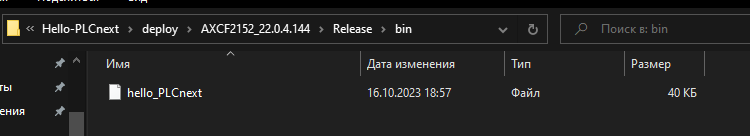
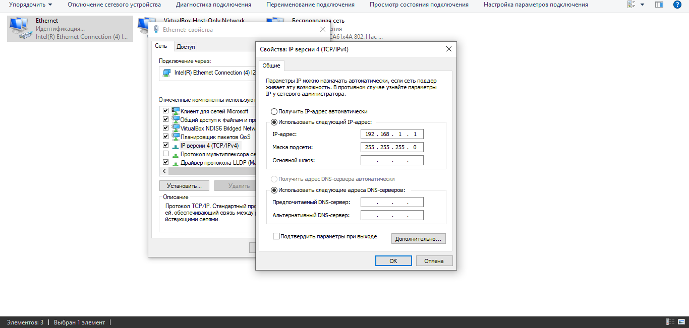
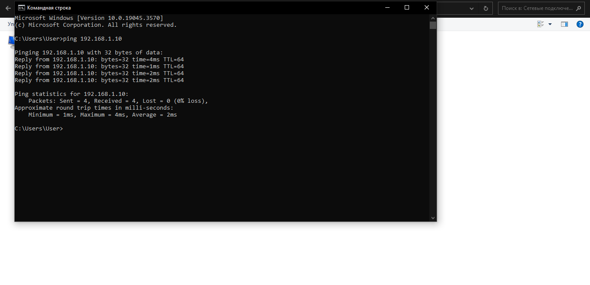
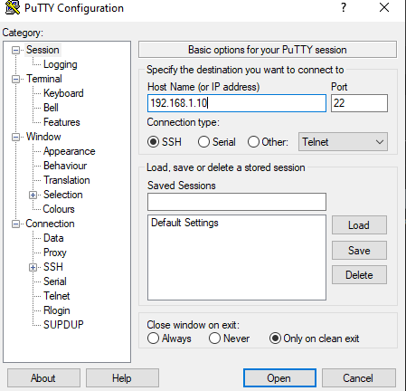
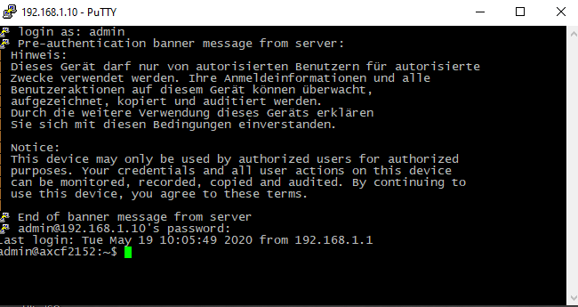
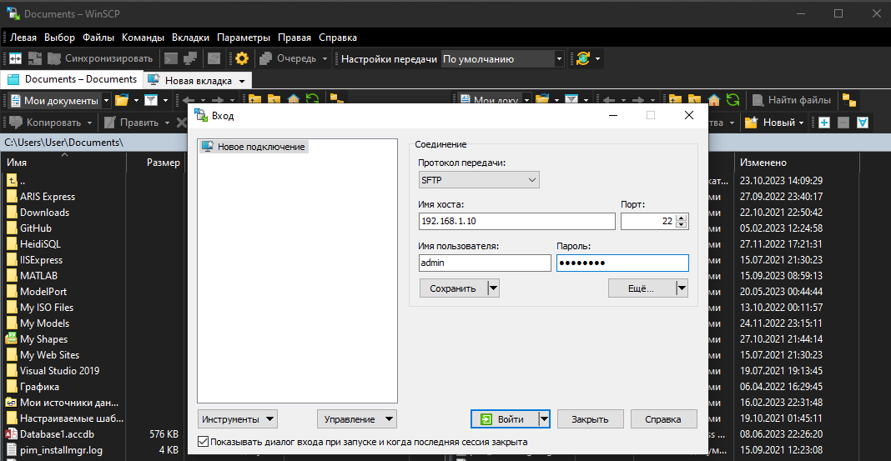
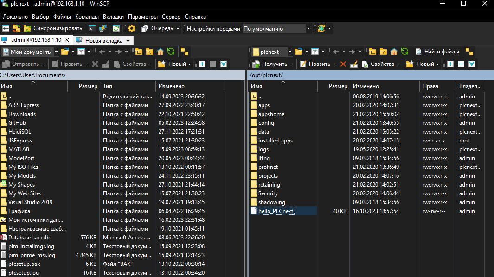
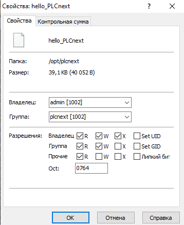
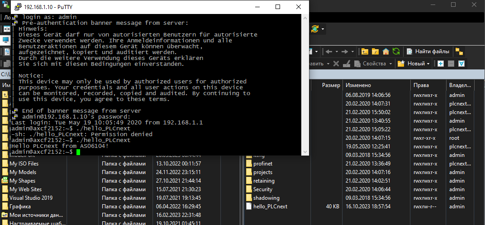
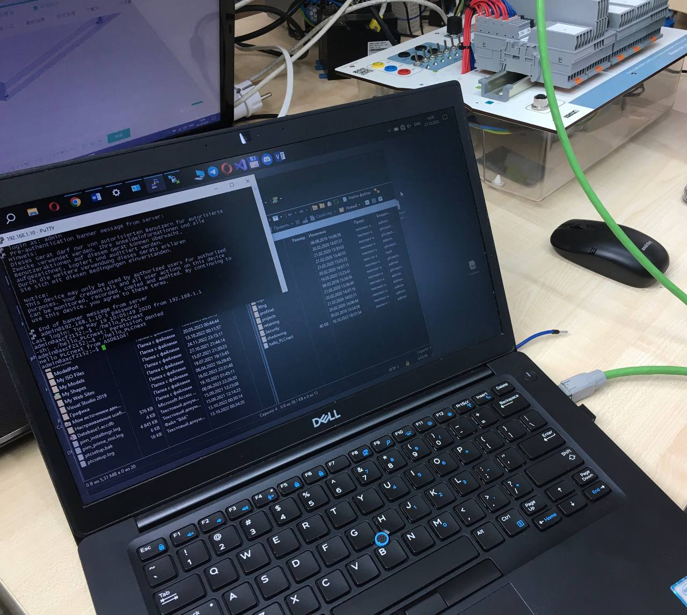

MINISTRY OF EDUCATION OF THE REPUBLIC OF BELARUS

EDUCATIONAL INSTITUTION

«BREST STATE TECHNICAL UNIVERSITY»
       

Department of IIT

    

Laboratory work №.3

   

Completed by the 3rd year student of
 

the Faculty of Electronic Information Systems

the group AC-61 Dzibuk A.V.

Checked by Ivanuk D.S.

   

Brest 2023

---

## Task 3. Work with AXC F 2152 controller:

Using Visual Code to create a test project "Hello PLCnext from AS06104!", build it and demonstrate performance on the test controller.

### Steps to run:
1. To clone "savushkin-r-d/PLCnext-howto" repository on a computer and build the executable file "hello_PLCnext" in Visual Code using CMake.

2. To connect to the controller via LAN-cable, after we set up IPV-4 connection. In the properties of this connection we need to use "192.168.1.1" ip-address and "255.255.255.0" mask.

3. For checking connection we use "ping 192.168.1.10" command in the command line, where "192.168.1.10" is controller's ip-address. If packets are not lost, then the connection is set correctly.

4. Install 2 programs on a computer: PuTTY and WinSCP.

5. Using PuTTY we connect to the controller, entering controller's ip-address, login - "admin" and password - "785*****". 

6. To transfer the executable file to the root of the controller using WinSCP program. We also enter the ip-address, the login and the password of the controller.

7. To change the access rights to start the executable file.

8. To run executable file.

