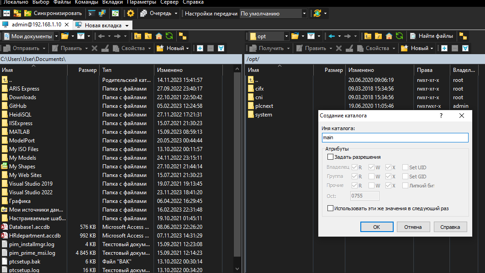
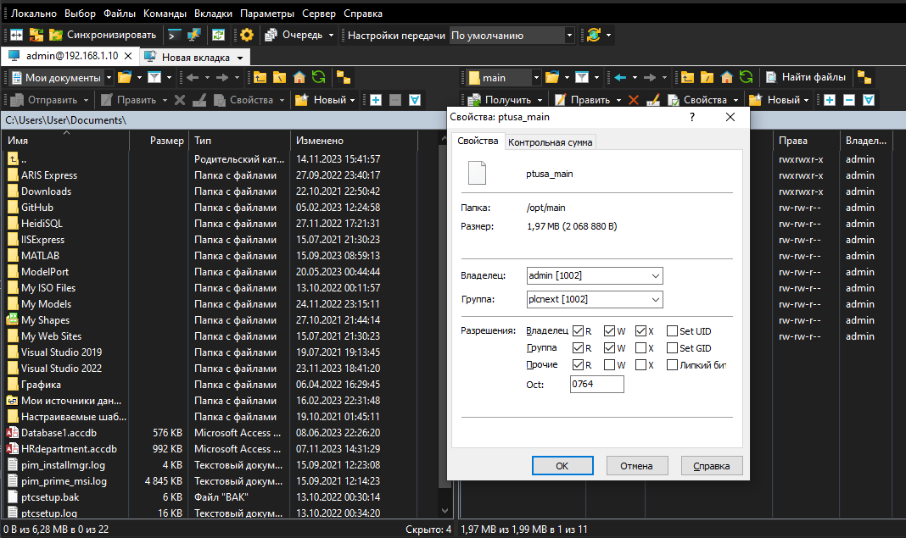
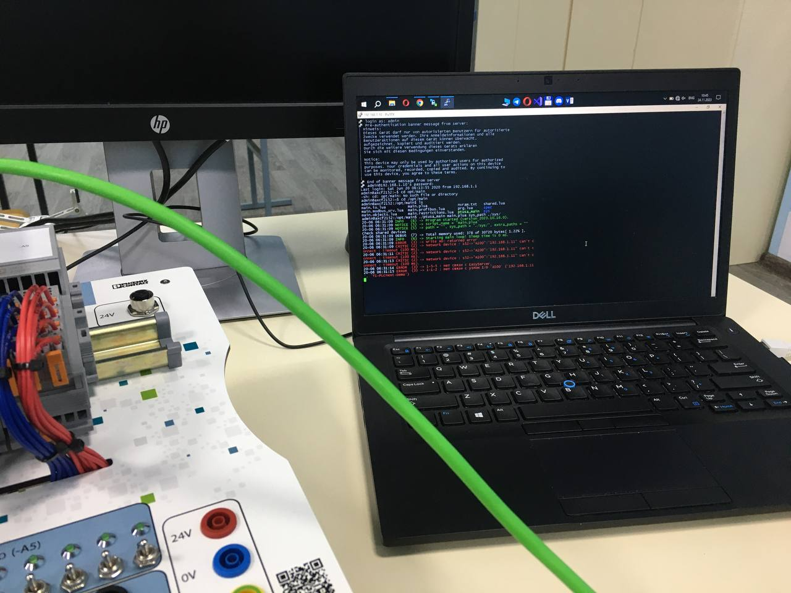

<p align="center">MINISTRY OF EDUCATION OF THE REPUBLIC OF BELARUS</p>
<p align="center">EDUCATIONAL INSTITUTION</p>
<p align="center">«BREST STATE TECHNICAL UNIVERSITY»</p>       
<p align="center">Department of IIT</p>
<br><br><br><br>
<p align="center">Laboratory work №.4</p>
<br><br><br>
<p align="right">Completed by the 3rd year student of</p> 
<p align="right">the Faculty of Electronic Information Systems</p>
<p align="right">the group AC-61 Dzibuk A.V.</p>
<p align="right">Checked by Ivanuk D.S.</p>
<br><br><br>
<p align="center">Brest 2023</p>

---

## Task 4. Work with AXC F 2152 controller:

Using Visual Studio to build the ptusa_main project and demonstrate performance on the test controller.

### Steps to run:
1. To clone "savushkin-r-d/ptusa_main" repository on a computer and build the executable file "ptusa_main" in Visual Studio 2022.
<p align="center">

2. To follow the steps 2-5 from the third laboratory work by clicking on the link below:  
[as0006104/task_03/doc/readme.md](https://github.com/brstu/TMAU-2023/blob/main/trunk/as0006104/task_03/doc/readme.md)


3. To create directory in the root of the controller, for example /opt/main/. To transfer the files with extensions .lua and .plua, directories spec and sys from the T1-PLCnext-Demo project and the executable file to the controller using WinSCP program.

<p align="center">
<p align="center">

4. To change the access rights to start the executable file.
<p align="center">

5. To run executable file using the following command:

```bash
./ptusa_main  main.plua  sys_path ./sys/
```

<p align="center">
<p align="center">
