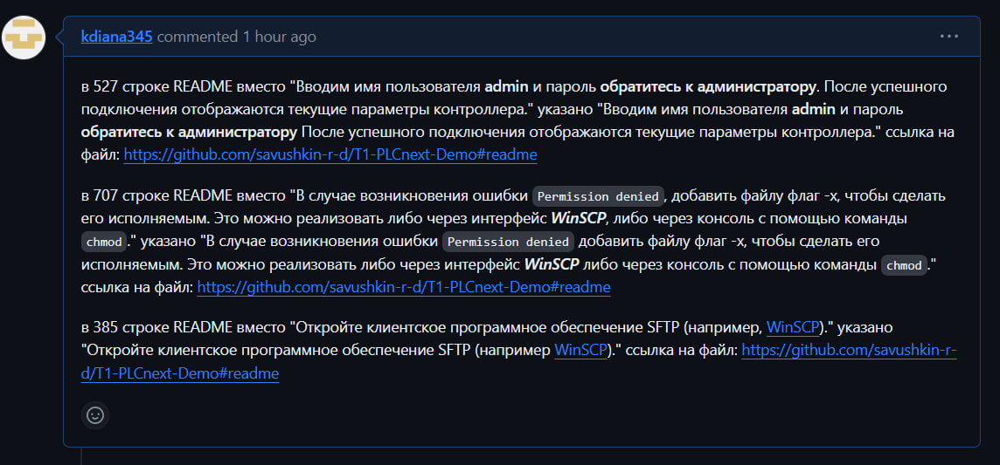

Министерство образования Республики Беларусь

Учреждение образования

“Брестский Государственный технический университет”

Кафедра ИИТ

      

<strong>Лабораторная работа №6</strong>

<strong>По дисциплине</strong> “Теория и методы автоматического управления”

<strong>Тема:</strong> “Работа с открытыми проектами”

      

<strong>Выполнил</strong>:

Студентка 3 курса

Группы АС-61

Касюк Д.А.

<strong>Проверил:</strong>

Иванюк Д. С.

     

<strong>Брест 2023</strong>

--- 

## Цель лабораторной работы: изучить такие открытые проекты: документация работы с технологией PLCnext - PLCnext-howto, дополнение для EPLAN Electric P8 - EPLANner, демо-проект T1-PLCnext-Demo и внести свой вклад в развитие проекта с помощью вопросов (issue), а также запросов на изменение.

## Процесс выполнения:

В ходе лабораторной работы мной был создан issue, в котором указаны найденные мной недочёты, можно перейти по [ссылке] (https://github.com/savushkin-r-d/T1-PLCnext-Demo/issues/39). Далее добавлен pull request [запрос на изменение] (https://github.com/savushkin-r-d/T1-PLCnext-Demo/pull/40).

Найденные недочёты:

 

 

## Выаод: в ходе лабораторной работы были изучены открытые проекты, получен навык работы с вопросов (issue).