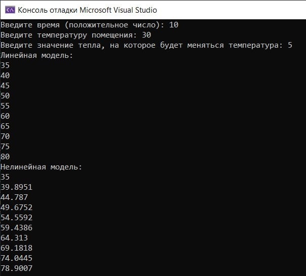
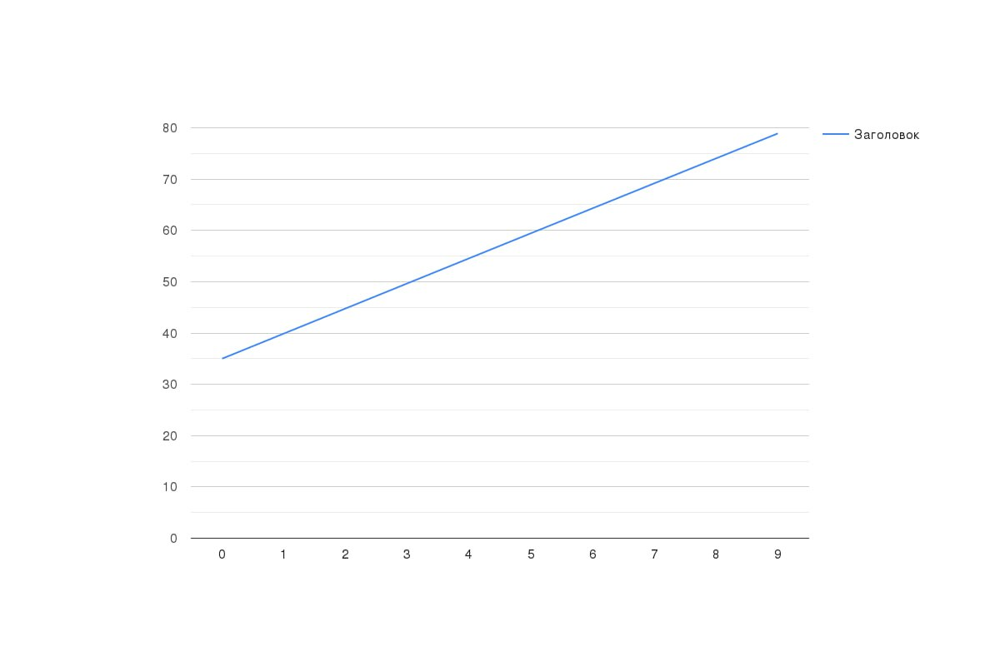

# Лабораторная работа №1 #
---
                        Министерство образования Республики Беларусь
             Учреждение образования  «Брестский государственный технический университет»
                                      Кафедра ИИТ
                                      
                                      
                                      
                                      
                                      
                                      
                                      
                                      
                                      
                                      
                                 Лабораторная работа №1
                     по дисциплине «Математические модели информационных процессов и управления»
                     «Моделирование контролируемого объекта»

                                      
                                      
                                      
                                      
                                      
                                      
                                      
                                      
                                      
                                      
                                      
                                      
                                                                                                       Выполнил: 
                                                                                                       студент 3 курса
                                                                                                       группы АС-61
                                                                                                       Клунин Т.И.
                                                                                                       Проверил: 
                                                                                                       Иванюк Д.С.
                                                                                                       
                                                                                                       
                                                                                                       
                                                                                                       
                                                                                                       
                                                                                                       
                                                                                                       
                                                 Брест 2023                                                      
                                                                                
---
### Цель работы: контроль температуры объекта. ###
## Ход работы ##

Константы брал случайно. Так как для линейной модели подходили значения в 1, взял равными 1.

Для нелинейной модели константа 'а' – это та же константа, что и для линейной модели.
И также константа 'c' является константой 'b' для линейной модели (так как стоят перед одинаковыми членами).

Константы 'b' разные, потому и назвал их соответственно для каждой модели.
'b' и 'd' для нелинейной модели брал методом перебора. Со значениями выше 1 было всё плохо, потому просто решил уменьшать эти коэффициенты.
Float взял, ибо в double не было необходимости.

Решил не использовать рекурсию, так как считаю это лишним риском и надёжнее использовать циклы, а рекурсия используется в достаточно специфичных ситуациях.

## Результаты работы программы: ##

## График линейной модели: ##

## График нелинейной модели: ##

