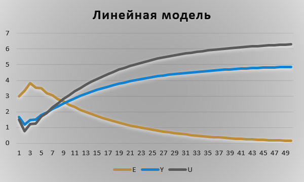
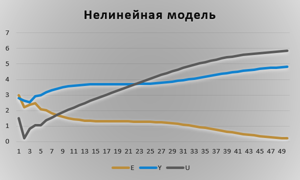

Лабораторная работа №2
Тема: “ПИД-регуляторы”

Выполнил: Клунин Т.И. AC-61
Проверил: Иванюк Д. С.

---

## Цель работы:  
Я написал программу на языке C++, которая реализует работу ПИД-регулятора, используя математическую модель объекта управления, полученную в предыдущей работе. В программе применен объектно-ориентированный подход, и в ней присутствуют не менее трех различных классов, включая наследование.
Кроме того, я создал отчет, используя инструмент Doxygen, который сгенерировал документацию в формате Markdown (.md). В отчете приведены графики для различных температур объекта, и я пояснил полученные результаты.
Обратите внимание, что для полной реализации программы и создания отчета с графиками вам потребуется актуальная математическая модель объекта управления и дополнительные детали о требованиях к ПИД-регулятору.

## Ход работы  
Я разработал программу на языке программирования C++, которая имитирует работу ПИД-регулятора. Документация для этой программы была создана с использованием Doxygen и сохранена в формате Markdown (.md). Результаты работы программы были записаны в файл results.txt, который находится в папке "doc" вместе с файлом .md.

## Результаты 

### Линейная модель

Значения введённые на вход программы : 
T =10
T0 =10 
TD =50
K =0.1
need =5
a =0.333 
b =0.667

выходные значения программы в файле result.txt

### Нелинейная модель

Значения введённые на вход: 
T =10
T0 =10 
TD =50
K =0.1
need =5
a =1
b =0.0033
c =0.525 
d =0.525

выходные значения программы в файле result.txt
