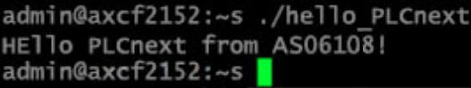
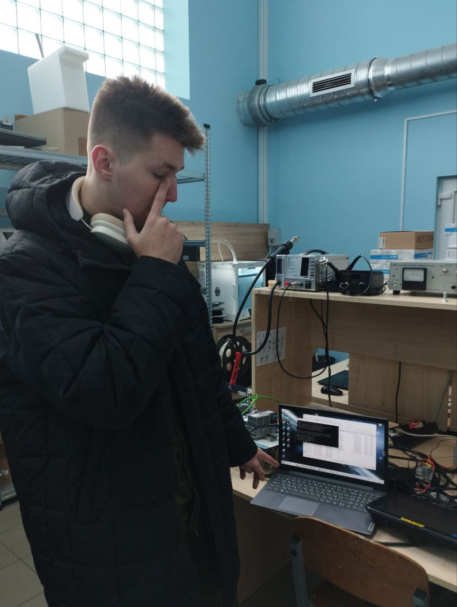

Министерство образования Республики Беларусь  
Учреждение образования   
Брестский Государственный Технический Университет  
Кафедра ИИТ
         
## Лабораторная работа №3
## "Работа с контроллером AXCF 2152"
         
Выполнил:  
Студент 3 курса  
Группы АС-61  
Клунин Т.И.  

Проверил:
Иванюк Д.С.
         
Брест 2023

### Цель работы: запустить проект на контроллере AXCF 2152
## Ход работы 
Перед тем, как приступить к работе, нужно сделать форк репозитория savushkin-r-d/PLCnext-howto.
Для компиляции проекта требуется MVS19. Кроме того, устанавливаем CMake, Cmake Tool и MinGW.
С помощью MVS открываем PLCnext-howto/HowTo build program/ Hello PLCnext. В нем находим Cpp файл. Меняем в нем текст на свой. В этом случае на as06108.
Попытка сборки. Если не получилось, то открываем PLCnext-howto-master/HowTo build program Hello PLCnext/Hello-PLCnext/CmakeCashe, ищем там строку "CMAKE_MAKE_PROGRAM:FILEPATH" и вписываем туда свой путь к ninja. По умолчанию он должен быть по пути C:/Program Files (x86)/MicrosoftVisualStudio/2019/Community/Common7/IDE/CommonExtensions/Microsoft/CMake/Ninja/ninja.exe
Снова компилируем проект.
Загружаем программы WinSCP и PuTTy.
Переходим в панель управления/Сеть и Интернет/Центр управления сетями и общим доступом, выбираем там сеть Ethernet и задаем ей ip 192.168.1.1, маску подсети 255.255.255.0
В PuTTy вводим ip 192.168.1.10, контроллер подключается.
В WinSCP вводим такой же ip, имя пользователя указываем "admin", а пароль находится на контроллере.
После входа в файловую систему контроллера переносим на него наш файл hello_PLCnext и даем ему все права и расширения, чтобы избежать ошибки permission denied.
Через терминал контроллера запускаем файл, вписав туда ./hello_PLCnext. Если все предыдущие действия были выполнены правильно, то в результате увидим в терминале контроллера строку "Hello PLCnext from as06108".

 