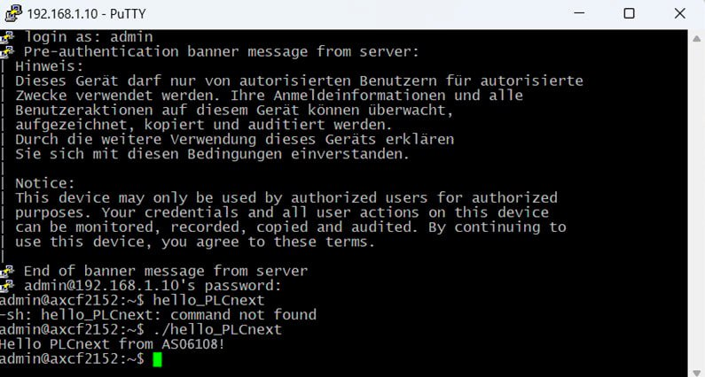

Министерство образования Республики Беларусь  
Учреждение образования   
Брестский Государственный Технический Университет  
Кафедра ИИТ
         
## Лабораторная работа №3
## "Работа с контроллером AXCF 2152"
         
Выполнил:  
Студент 3 курса  
Группы АС-61  
Клунин Т.И.  

Проверил:
Иванюк Д.С.
         
Брест 2023

### Цель работы: запустить проект на контроллере AXCF 2152
## Ход работы 
Шаги для выполнения данной работы:

1) Создайте форк репозитория savushkin-r-d/PLCnext-howto.

2) Установите следующие компоненты:
   - MVS19: необходимая среда разработки для сборки проекта.
   - CMake: инструмент для автоматизации процесса сборки программного обеспечения.
   - Cmake Tool: дополнительный инструмент с графическим интерфейсом для работы с проектами, созданными с использованием CMake.
   - MinGW: набор инструментов для разработки приложений под платформу Windows.

3) Откройте PLCnext-howto/HowTo build program/Hello PLCnext с использованием MVS. Внутри найдите Cpp файл и замените его содержимое на свое, в данном случае - на as06108.

4) Попытайтесь выполнить сборку проекта. Если это не удается, откройте PLCnext-howto-master/HowTo build program Hello PLCnext/Hello-PLCnext/CmakeCache. Найдите запись "CMAKE_MAKE_PROGRAM:FILEPATH" и укажите путь к установленному ninja. По умолчанию, путь должен быть C:/Program Files (x86)/MicrosoftVisualStudio/2019/Community/Common7/IDE/CommonExtensions/Microsoft/CMake/Ninja/ninja.exe.

5) Повторно выполните компиляцию проекта.

6) Получите программы WinSCP и PuTTy.

7) Перейдите в панель управления -> Сеть и Интернет -> Центр управления сетями и общим доступом. Выберите сеть Ethernet и установите IP-адрес 192.168.1.1 и маску подсети 255.255.255.0.

8) В PuTTy введите IP-адрес 192.168.1.10 для подключения к контроллеру.

9) В WinSCP введите тот же IP-адрес и укажите имя пользователя "admin". Пароль можно найти на контроллере.

10) После входа в файловую систему контроллера переместите файл hello_PLCnext на контроллер и предоставьте ему все необходимые права и расширения, чтобы избежать ошибки "permission denied".

11) В терминале контроллера выполните файл, введя команду ./hello_PLCnext. Если все предыдущие действия были выполнены правильно, то на экране терминала контроллера появится строка "Hello PLCnext from as06108".

Вывод: Для успешного выполнения данной работы необходимо выполнить ряд шагов, включая создание форка репозитория, установку необходимых инструментов, изменение и сборку проекта, настройку сетевых параметров и загрузку файла на контроллер. После этого можно выполнить файл на контроллере и увидеть ожидаемый результат.

 
