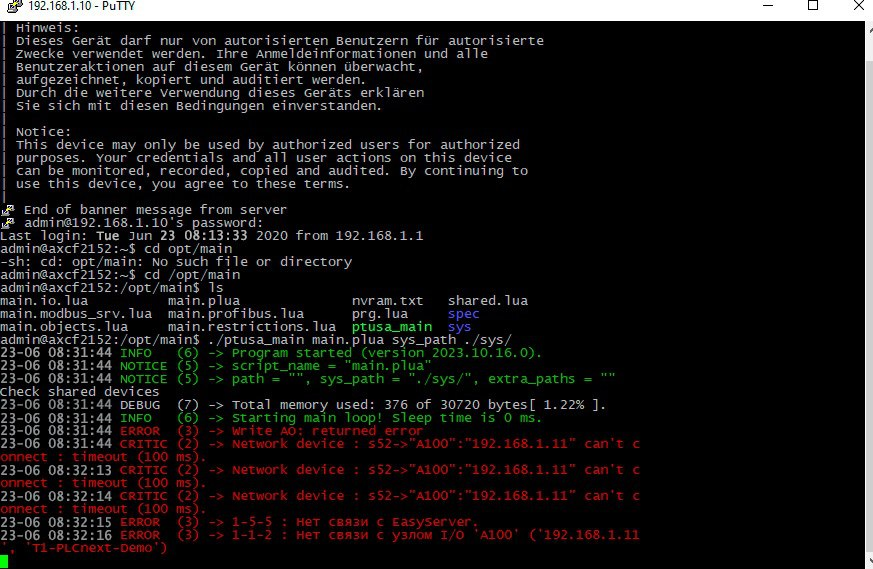

Лабораторная работа №4

Тема: “Работа с контроллером AXC F 2152”

<strong>Выполнил: Студент 3 курса Группы АС-61 Клунин Т.И.</strong>

<strong>Проверил: Старший преподаватель Иванюк Д.С.</strong>

Брест 2023

### Цель: 
Освоить процесс сборки и запуска проекта на контроллере AXCF 2152. 

### Задание:

- Познакомиться с основными характеристиками и возможностями платформы PLCnext.
- Изучить структуру и функциональность проекта ptusa_main.
- С помощью Visual Studio скомпилировать данный проект и продемонстрировать его работу на тестовом контроллере.
- Составить отчет о выполненной работе в формате .md (readme.md) и с помощью pull request разместить его в следующей директории: trunk\as000xxyy\task_04\doc.

### Ход работы:

Первым делом скопируем репозиторий ptusa_main для дальнейшей работы

[ptusa_main](https://github.com/savushkin-r-d/ptusa_main)

Открываем скопированный репозиторий в Visual Studio , создаем проект на основе CMake.
 

С помощью Visual Studio собираем проект.
 

Подключаемся к контроллеру, аналогично тому, как это было сделано в 3 лабораторной работе: 

[task_03](../../task_03/doc/readme.md)

Переходим в папку с проектом и запускаем программу:
<strong>./ptusa_main main.plua sys_path ./sys/</strong>

 Получаем результат в виде следующего вывода в консоли:  

### Вывод:
В процессе выполнения лабораторной работы я приобрел опыт работы в командной среде, улучшил свои навыки использования системы контроля версий Git и платформы GitHub. Также я успешно собрал и проверил работоспособность проекта ptusa_main, а также получил опыт работы с контроллером.