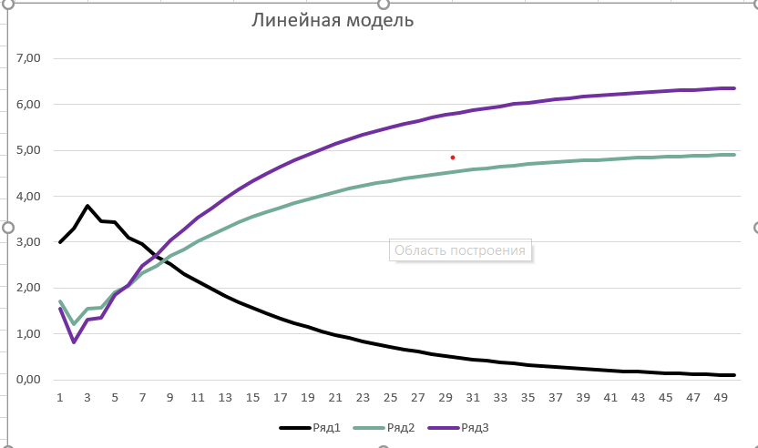
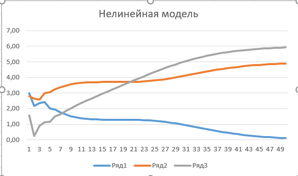

 Министерство образования Республики Беларусь

Учреждение образования

“Брестский Государственный технический университет”

Кафедра ИИТ

       

Лабораторная работа №2

По дисциплине “Теория и методы автоматического управления”

Тема: “ПИД-регуляторы”

     

Выполнил:

Студент 3 курса

Группы АС-61

Леонович А.А.

Проверил:

Иванюк Д. С.

     

Брест 2023

---

## Цель работы:  
На языке программирования C++ реализовать программу, которая будет моделировать ПИД-регулятор. В качестве объекта управления использовать модель, которую мы получили в предыдущей лабе. Использовать методы ООП, в программе должно быть не менее 3-х различных классов (+наследование). В отчете также требуется графики для разных температур объекта, пояснить полученные результаты (отчет получать с помощью Doxygen в .md формате). 

## Ход работы  
Реализовал программу на языке программированяи c++, которая моделируюет работу ПИД-регулятор. Документация программы была сделана с помощью Doxygen и переведенна в md формат. Результаты работы данной программы были записаны в файл results.txt. Он лежит в каталоге doc, вместе с .md.

## Результаты 

### Линейная модель

Значения введённые на вход: 
    T = 11
    T0 = 11 
    TD = 41
    K = 0.11
    need = 10

    a = 0.333 
    b = 0.667

выходные значения в файле result.txt

### Нелинейная модель

Значения введённые на вход: 
    T = 11
    T0 = 11 
    TD = 41
    K = 0.11
    need = 5

    a = 1
    b = 0.0033
    c = 0.525 
    d = 0.525

выходные значения в файле result.txt
