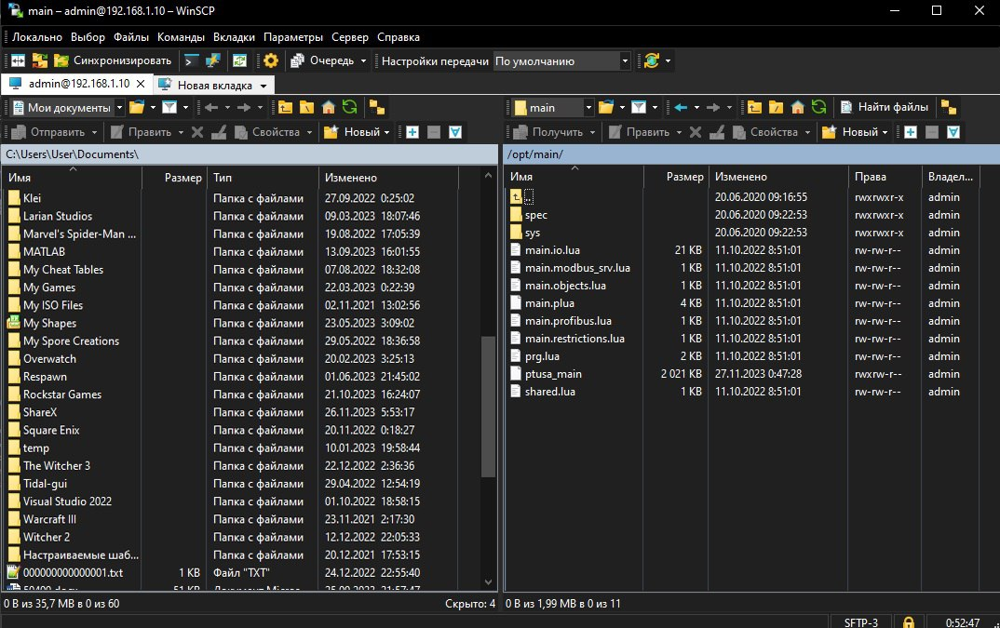
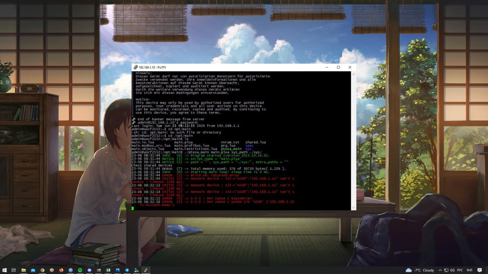
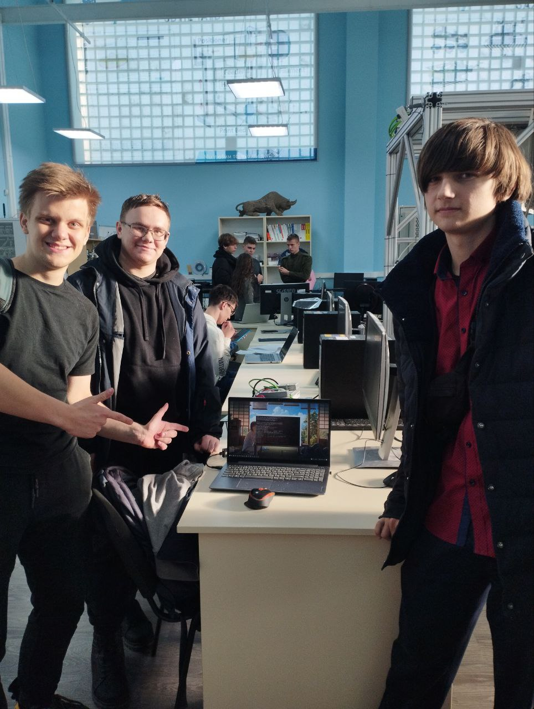

Министерство образования Республики Беларусь  
Учреждение образования   
Брестский Государственный Технический Университет  
Кафедра ИИТ
<br/><br/><br/><br/><br/><br/><br/><br/><br/>
## Лабораторная работа №4
## "Работа с контроллером AXCF 2152"
<br/><br/><br/><br/><br/><br/><br/><br/><br/>
Выполнил:  
Студент 3 курса  
Группы АС-61  
Леонович А.А.  

Проверил:
Иванюк Д.С.
<br/><br/><br/><br/><br/><br/><br/><br/><br/>
Брест 2023

---

# Задание:
1. Ознакомиться с общей информацией о платформе PLCnext.
2. Изучить проект ptusa_main.
3. Используя Visual Studio собрать данный проект и продемонстрировать работоспособность на тестовом контроллере..

# Ход работы:

<p>1) Для выполнения этой задачи начнем с сборки файла <em>ptusa_main</em>. Процесс начнем с клонирования репозитория, что можно сделать с помощью следующей команды:</p>

 ``` bash
git clone --recurse-submodules https://github.com/savushkin-r-d/ptusa_main.git 
```

<p>2) Затем, следуя инструкциям из репозитория, производим сборку проекта:</p>

``` bash
https://github.com/savushkin-r-d/ptusa_main/tree/master/russian_readme#%D0%BA%D0%B0%D0%BA-%D1%81%D0%BE%D0%B1%D1%80%D0%B0%D1%82%D1%8C-%D0%BF%D1%80%D0%BE%D0%B5%D0%BA%D1%82
```

<p>3) После этого мы подключаемся к контроллеру</p>

<p>4) Переходим в директорию проекта и запускаем программу:</p>

``` bash

./ptusa_main  main.plua  sys_path  ./sys/

```

<p>5) В результате получаем вывод в консоли:</p>







<p>6)Над этой лабораторной работали мы в 3 </p>



# Основные проблемы с которыми я столкнулся
 Когда мы пришли делать лабораторную нас попросили удалиться в другую зону потому что пришло слишком много людей, нам прочитали лекцию про то что мы приходим когда у других занятия, также у нас на ноутбуке не было Ethernet провода и приходилось прийти в другой раз с проводником usb-ethernet. 

 # Вывод:
  В процессе выполнения этой лабораторной работы были изучены новые возможности в среде Visual Studio, также мы продолжили исследование возможностей, которые предоставляют нам возможность работы с контроллерами, нами был выбран Visual Studio так как она является одной из ведущих платформ для разработки программного обеспечения. Освоение дополнительных функций и инструментов этой среды позволит нам повысить эффективность разработки и качество конечного продукта. мы получили дополнительные навыки работы с тестовым контроллером AXC F 2152. Это устройство является ключевым элементом в нашей лабораторной работе, и наше знакомство с ним позволило нам лучше понять его функциональность и применение в различных сценариях. Мы изучили различные аспекты работы с контроллером, включая программирование и тестирование. Успешно выполнена сборка проекта и получены дополнительные навыки работы с тестовым контроллером AXC F 2152. Это устройство, благодаря своей мощности и многофункциональности, позволяет реализовывать сложные проекты в области промышленной автоматизации. Наши полученые навыки, после этой и 3 лабороторной работы с этим контроллером, могут быть применены в различных проектах, начиная с задач мониторинга и управления, и заканчивая системами требующими интеграции с другими устройствами и сервисами.</p>
  <p></p>