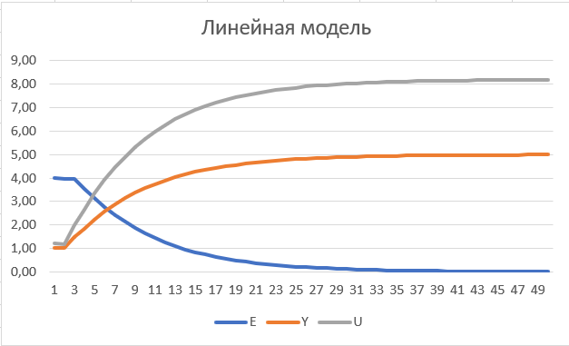

<p align="center">Министерство образования Республики Беларусь</p>
<p align="center">Учреждение образования</p>
<p align="center">“Брестский Государственный технический университет”</p>
<p align="center">Кафедра ИИТ</p>
<br><br><br><br><br><br>
<p align="center"><strong>Лабораторная работа №2</strong></p>
<p align="center"><strong>По дисциплине</strong> “Теория и методы автоматического управления”</p>
<p align="center"><strong>Тема:</strong> “ПИД-регуляторы”</p>
<br><br><br><br><br><br>
<p align="right"><strong>Выполнила</strong>:</p>
<p align="right">Студентка 3 курса</p>
<p align="right">Группы АС-61</p>
<p align="right">Линкевич П.С.</p>
<p align="right"><strong>Проверил:</strong></p>
<p align="right">Иванюк Д. С.</p>
<br><br><br><br><br>
<p align="center"><strong>Брест 2023</strong></p>

---
***Цель:***
На C++ реализовать программу, моделирующую рассмотренный выше ПИД-регулятор. В качестве объекта управления использовать математическую модель, полученную в предыдущей работе. Использовать ООП, в программе должно быть не менее 3-х классов (+наследование).
<br><br><br>
***Задание***:
1.  На C++  реализовать программу, моделирующую рассмотренный выше ПИД-регулятор.  В качестве объекта управления использовать математическую модель, полученную в предыдущей работе. Использовать ООП, в программе должно быть не менее 3-х классов (+наследование).
2.  Написать отчет по выполненной лабораторной работе №2 в .md формате (*readme.md*) и с помощью **pull request** разместить его в следующем каталоге: **trunk\as000xxyy\task_02\doc**. В отчете также привести графики для разных заданий температуры объекта, пояснить полученные результаты.
3.  В отчет с помощью [Doxygen](https://doxygen.nl/) (в .md формате) добавить информацию о разработанной программе (диаграмма классов и т.п.).
4.  Исходный код написанной программы разместить в каталоге: **trunk\as000xxyy\task_02\src**.
<br><br><br>
---
##Графики
### Линейная модель:
Значения:  K = 0.1, T = 10, T0 =  20, TD = 40, W = 5, a =0.35, b = 0.567.


### Нелинейная модель:
Значения:  K = 0.1, T = 10, T0 = 20, TD = 40, W = 5, a = 1, b = 0.0025, c = 0.614, d = 0.777.


---
<br><br><br>
***Результат:***
``` bash
Линейная модель :
E               Y               U
----------------------------------------------------
 4 				 1.0304		1.2
 3.9696 		 1.02523	1.19088
 3.97477 		 1.47971    1.99243
 3.52029 		 1.85255	2.65001
 3.14745 		 2.23987	3.33311
 2.76013 		 2.57319	3.92097
 2.42681 		 2.87341	4.45046
 2.12659 		 3.13534	4.91242
 1.86466 		 3.36599	5.31921
 1.63401 		 3.56791	5.67533
 1.43209 		 3.74502	5.98768
 1.25498 		 3.90019	6.26135
 1.09981 		 4.03619	6.50122
 0.963808 		 4.15537	6.71142
 0.844627 		 4.25982	6.89562
 0.740181 		 4.35135	7.05705
 0.648651 		 4.43156	7.19852
 0.56844 		 4.50185	7.32249
 0.498147 		 4.56345	7.43113
 0.436547 		 4.61744	7.52634
 0.382564 		 4.66474	7.60978
 0.335257 		 4.7062		7.68289
 0.293799 		 4.74253	7.74697
 0.257468 		 4.77437	7.80312
 0.22563 		 4.80227	7.85233
 0.197729 		 4.82672	7.89545
 0.173278 		 4.84815	7.93324
 0.151851 		 4.86693	7.96636
 0.133073 		 4.88338	7.99538
 0.116617 		 4.8978		8.02082
 0.102197 		 4.91044	8.04311
 0.0895591 		 4.92152	8.06264
 0.0784844 		 4.93122	8.07975
 0.0687791 		 4.93973	8.09475
 0.0602739 		 4.94718	8.1079
 0.0528205 		 4.95371	8.11942
 0.0462888 		 4.95944	8.12952
 0.0405648 		 4.96445	8.13836
 0.0355486 		 4.96885	8.14612
 0.0311527 		 4.9727		8.15291
 0.0273004 		 4.97608	8.15886
 0.0239245 		 4.97903	8.16408
 0.020966 		 4.98163	8.16865
 0.0183734 		 4.9839		8.17266
 0.0161013 		 4.98589	8.17617
 0.0141103 		 4.98763	8.17925
 0.0123654 		 4.98916	8.18195
 0.0108363 		 4.9905		8.18431
 0.00949631		 4.99168	8.18638
 0.00832201 	 4.99271	8.1882


Нелинейная модель :
E               Y               U
---------------------------------------------------- 
 4 				 1.7368     1.2
 3.2632 		 2.32278    0.97896
 2.67722 		 2.62669    1.60317
 2.37331 		 3.10318    2.16463
 1.89682 		 3.21156    2.55713
 1.78844 		 3.26777    2.99928
 1.73223 		 3.17184    3.36178
 1.82816 		 3.12922    3.74825
 1.87078 		 3.07651    4.10748
 1.92349 		 3.11458    4.48893
 1.88542 		 3.21874    4.85166
 1.78126 		 3.42396    5.20511
 1.57604 		 3.70259    5.52063
 1.29741 		 4.01785    5.79329
 0.982148 		 4.32445    6.01392
 0.675554 		 4.5862     6.18143
 0.413803 		 4.78636    6.29933
 0.213642 		 4.92392    6.37439
 0.076079 		 5.00762    6.41588
 -0.00762283 	 5.05048    6.4335
 -0.0504751 	 5.06548    6.43586
 -0.0654763 	 5.06359    6.42984
 -0.0635898 	 5.05311    6.42031
 -0.0531099 	 5.03967    6.41036
 -0.0396702 	 5.02667    6.40167
 -0.0266722 	 5.01585    6.39495
 -0.0158464 	 5.00778    6.39026
 -0.00778012 	 5.00237    6.38735
 -0.00237112 	 4.99917    6.3858
 0.000830477 	 4.99761    6.38521
 0.00239141 	 4.99714    6.3852
 0.00285538 	 4.99733    6.3855
 0.00267253 	 4.99782    6.38593
 0.00217657 	 4.99841    6.38635
 0.00159001 	 4.99896    6.38671
 0.00104349 	 4.9994     6.38698
 0.000599779 	 4.99972    6.38717
 0.000276544 	 4.99993    6.38728
 ```
 
<br><br><br>


