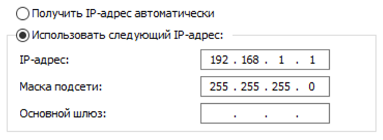
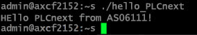
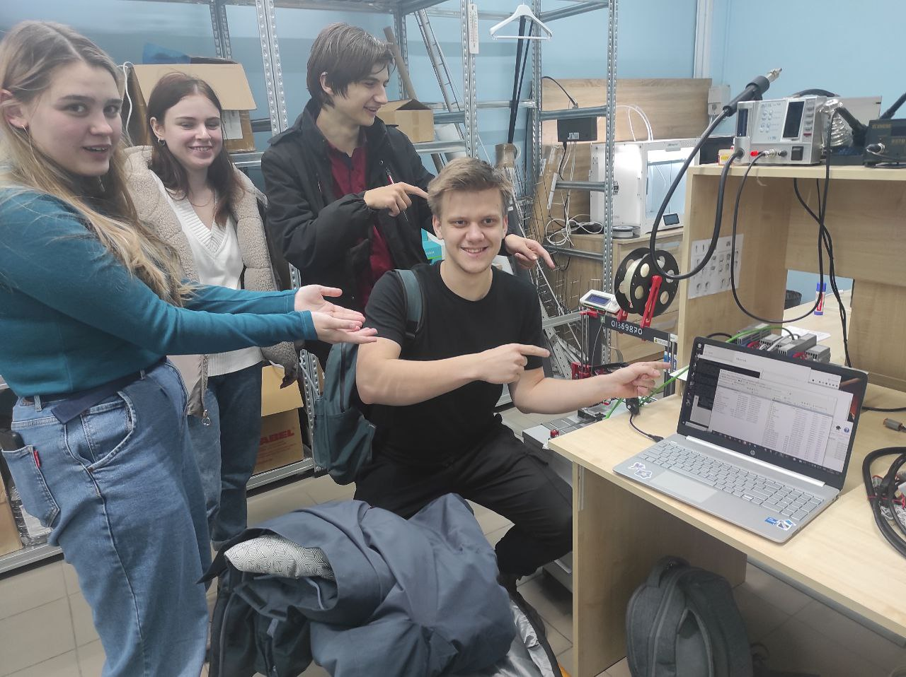

<p align="center">Министерство образования Республики Беларусь</p>
<p align="center">Учреждение образования</p>
<p align="center">“Брестский Государственный технический университет”</p>
<p align="center">Кафедра ИИТ</p>
<br><br><br><br><br><br>
<p align="center"><strong>Лабораторная работа №3</strong></p>
<p align="center"><strong>По дисциплине</strong> “"Работа с контроллером AXCF 2152"”</p>
<p align="center"><strong>Тема:</strong> “Моделирования температуры объекта”</p>
<br><br><br><br><br><br>
<p align="right"><strong>Выполнила</strong>:</p>
<p align="right">Студентка 3 курса</p>
<p align="right">Группы АС-61</p>
<p align="right">Линкевич П.С.</p>
<p align="right"><strong>Проверил:</strong></p>
<p align="right">Иванюк Д. С.</p>
<br><br><br><br><br>
<p align="center"><strong>Брест 2023</strong></p>

---
***Цель:***
Научиться сборке и запуску проекта на контроллере AXCF 2152.
<br><br><br>
***Задание***:
``` bash
1) Ознакомиться с платформой PLCnext.
2) Изучить руководство.
3) Используя Visual Code создать тестовый проект "Hello PLCnext from AS006111!", собрать его и продемонстрировать работоспособность на тестовом контроллере.
4) Написать отчет в Morkdown формате (readme.md) и разместить pull request в следующем каталоге: trunk\as0006111\task_03\doc.
```
<br><br><br>

***Последовательность действий:***
Делаем форк репозитрия savushkin-r-d/PLCnext-howto.<br>
Устанавливаем CMake, Cmake Tool,WinSCP, PuTTy, MinGW, MVS19 (через него открываем PLCnext-howto/HowTo build program/ Hello PLCnext).<br>
В cpp файле меняем часть на as006111.<br>
В PLCnext-howto-master/HowTo build program Hello PLCnext/Hello-PLCnext/CmakeCashe в строку "CMAKE_MAKE_PROGRAM:FILEPATH" прописываем путь к ninja.<br>
Пересобиаем проект.<br>
В панели управления "Сеть и Интернет/Центр управления сетями и общим доступом" выбираем  сеть Ethernet, вводим ip 192.168.1.1 и маску 255.255.255.0, PuTTy прописываем ip 192.168.1.10.<br>

Прописываем ip в WinSCP и указываем имя пользователя "admin".(Пароль написан на самом контроллере)<br>
Файл hello_PLCnext перемещаем в файловую систему контроллера, даём все расширения и права. <br>
Вводим в терминал "./hello_PLCnext" - это запуск проекта. <br>
Вывод программы: "Hello PLCnext from as006111". <br>

<br><br>
<strong><em>Вывод:</em></strong>
<p>В ходе лабораторной работы мы научились собирать проект для контроллера AXCF 2152 и запускать его. </p>



