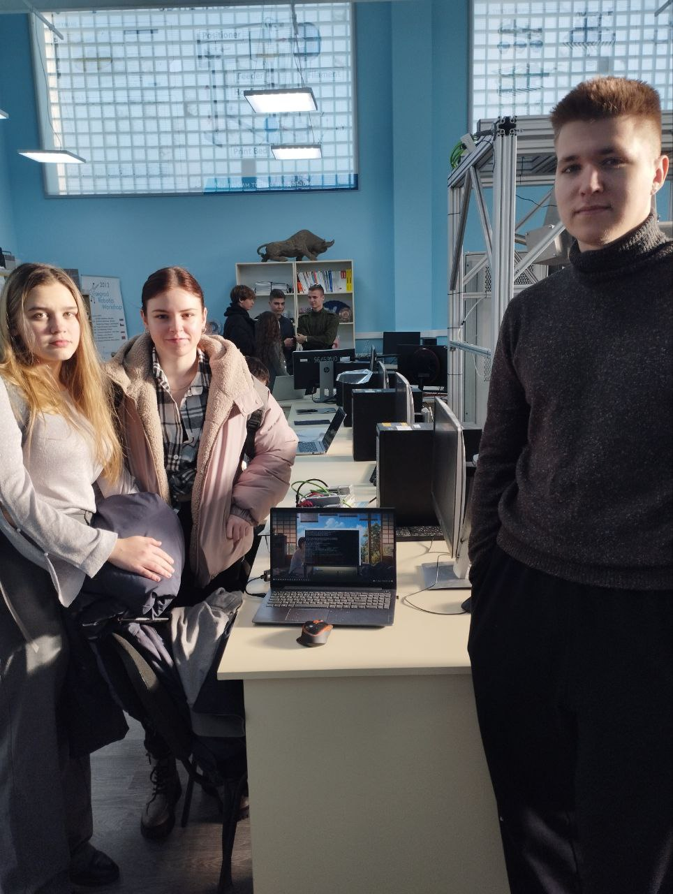

<p align="center">Ministry of Education of the Republic of Belarus</p>
<p align="center">Educational institution</p>
<p align="center">Brest State Technical University</p>
<p align="center">Department of IIT</p>
<br><br><br><br><br><br>
<p align="center"><strong>Laboratory work No.4</strong></p>
<p align="center"><strong>By discipline</strong> “"Working with the AXCF 2152 controller"”</p>
<p align="center"><strong>Subject:</strong> “Modeling the temperature of an object”</p>
<br><br><br><br><br><br>
<p align="right"><strong>Completed </strong>:</p>
<p align="right">3rd year student</p>
<p align="right">AC-61 groups</p>
<p align="right">Linkevich P.S.</p>
<p align="right"><strong>Checked:</strong></p>
<p align="right">Ivanyuk D. S.</p>
<br><br><br><br><br>
<p align="center"><strong>Brest 2023</strong></p>

---
***Цель:***
Научиться сборке и запуску проекта на контроллере AXCF 2152.
<br><br><br>
***Задание***:
``` bash
1) Ознакомиться с общей информацией о платформе PLCnext здесь.
2) Изучить проект ptusa_main.
3) Используя Visual Studio собрать данные проект и продемонстрировать работоспособность на тестовом контроллере.
4)Написать отчет по выполненной работе в .md формате (readme.md) и с помощью pull request разместить его в следующем каталоге: trunk\as000xxyy\task_04\doc.
<br><br><br>
```

***Последовательность действий:***
<br>
• Клонируем репозиторий <br>

<strong>[ptusa_main](https://github.com/savushkin-r-d/ptusa_main).</strong>

<p>• Открываем этот репозиторий в <strong>Visual Studio</strong>, создаем проект на базе <strong>CMake</strong>.</p>
<p>• С помощью <strong>Visual Studio</strong>  компилируем проект.</p> 
<p>• Подключаемся к контроллеру, по тому же принципу, что и в 3 лабораторной работе: </p>

[task_03](../../task_03/doc/readme.md).
<br>


<br>

• Переходим в папку с проектом и запускаем программу:<br>

<strong>./ptusa_main  main.plua  sys_path  ./sys/</strong>

<br>
• Получаем результат в виде следущего вывода в консоли: <br>


<br><br>
<strong><em>Вывод:</em></strong>
<p>В ходе лабораторной работы мы научились собирать проект для контроллера AXCF 2152 и запускать его. </p>


