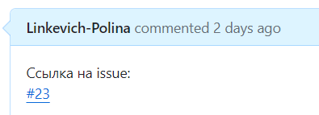

<p align="center">Министерство образования Республики Беларусь</p>
<p align="center">Учреждение образования</p>
<p align="center">“Брестский Государственный технический университет”</p>
<p align="center">Кафедра ИИТ</p>
<br><br><br><br><br><br>
<p align="center"><strong>Лабораторная работа №6</strong></p>
<p align="center"><strong>По дисциплине</strong> “Теория и методы автоматического управления”</p>
<p align="center"><strong>Тема:</strong> “Работа с открытыми проектами”</p>
<br><br><br><br><br><br>
<p align="right"><strong>Выполнила</strong>:</p>
<p align="right">Студентка 3 курса</p>
<p align="right">Группы АС-61</p>
<p align="right">Линкевич П.С.</p>
<p align="right"><strong>Проверил:</strong></p>
<p align="right">Иванюк Д. С.</p>
<br><br><br><br><br>
<p align="center"><strong>Брест 2023</strong></p>

---
***Цель:***
Научиться работате с открытыми проектами в git hub.
<br><br><br>
***Задание***:
<br><br><br>
``` bash
1) Изучить следующие открытые проекты:

Документация работы с технологией PLCnext - PLCnext-howto;
Управляющая программа для контроллеров PLCnext Control - ptusa-main;
Дополнение для EPLAN Electric P8 - EPLANner;
Демо-проект T1-PLCnext-Demo.

2) Внести свой вклад в проект (в виде оформления вопросов (issue) и запросов на внесение изменений (pull request)):

предложить исправления в ошибках в документации (синтаксические, орфографические и т.п.);
предложить исправления в исходном коде;
предложить новую функциональность.
```
<br><br><br>
***Последовательность действий***:
<br><br><br>
<p>Делаем форк репозитория <em>https://github.com/savushkin-r-d/T1-PLCnext-Demo</em> и клонируем его на компьютер. </p>
<p>Создаем issue с предложением об исправлениии или нововведениях. </p>
<p>В склонированном репозитории меняем. В соответствии с изменениями, делаем коммит и пушим.</p>
<p>Делаем pull request, указав ссылку на issue в описании. </p>
<br><br><br>


<br>



<br><br><br>
<strong><em>Вывод:</em></strong>
 <p>В ходе лабораторной работы мы научились работать с открытыми репозиториями и делать issue. </p>
