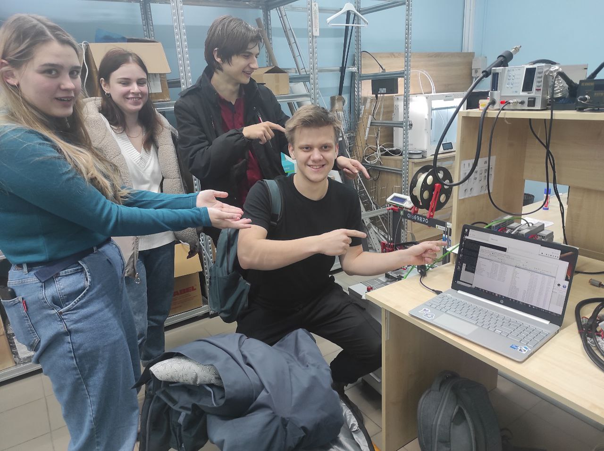

Министерство образования Республики Беларусь  
Учреждение образования   
Брестский Государственный Технический Университет  
Кафедра ИИТ
         
## Лабораторная работа №3
## "Работа с контроллером AXCF 2152"
         
Выполнил:  
Студент 3 курса  
Группы АС-61  
Лис С.С.  

Проверил:
Иванюк Д.С.
         
Брест 2023

### Цель работы: запустить проект на контроллере AXCF 2152
## Ход работы 
Для начала работы необходимо сделать форк репозитрия savushkin-r-d/PLCnext-howto.   
Для сборки проекта потребуется MVS19. Также устанавливаем CMake, Cmake Tool и MinGW.   
Через MVS открываем PLCnext-howto/HowTo build program/ Hello PLCnext. Там открываем Cpp файл. В нём надпись меняем на свою. В данном случае на as006112.  
Пытаемся собрать. Если сборка не удалась, то открываем PLCnext-howto-master/HowTo build program Hello PLCnext/Hello-PLCnext/CmakeCache, находим там строчку "CMAKE_MAKE_PROGRAM:FILEPATH" и прописываем туда свой путь к ninja. По-умолчанию должен установиться по пути C:/Program Files (x86)/MicrosoftVisualStudio/2019/Community/Common7/IDE/CommonExtensions/Microsoft/CMake/Ninja/ninja.exe   
Пересобиаем проект.   
Скачиваем программы WinSCP и PuTTy.   
Заходим в панель управления/Сеть и Интернет/Центр управления сетями и общим доступом, выбираем там сеть Ethernet и прописываем ей ip 192.168.1.1, маску подсети 255.255.255.0
В PuTTy прописываем ip 192.168.1.10, контроллёр подключается.
В WinSCP пишем такой же ip, имя пользователя указывается как "admin", а пароль находится на контроллере.   
После входа в файловую систему контроллера перемещаем наш файл hello_PLCnext на него и даём все расширения и права во избежание ошибки permission denied.   
Через терминал контроллера запустим файл, прописав туда ./hello_PLCnext. При правильном выполнении всех предыдущих действий в результате увидим в терминале контроллера строку "Hello PLCnext from as006112".   

