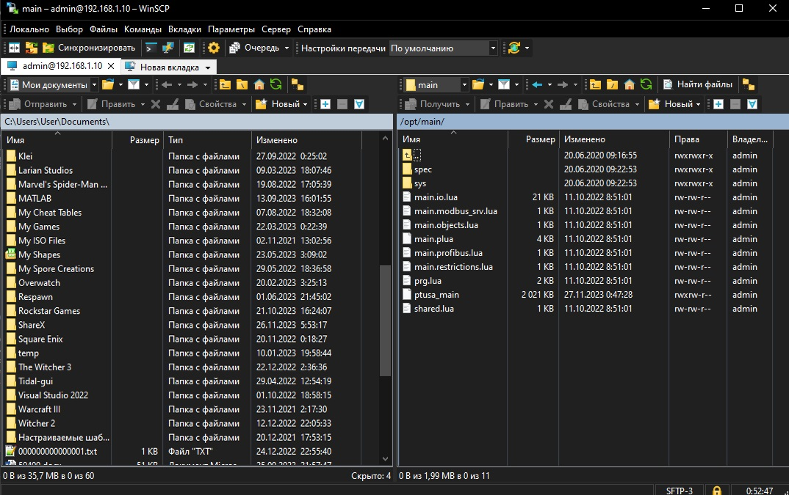
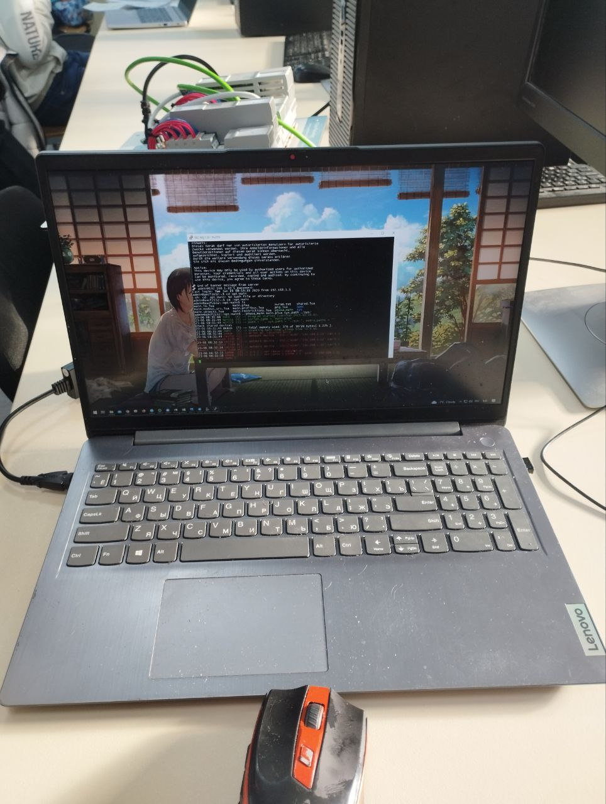
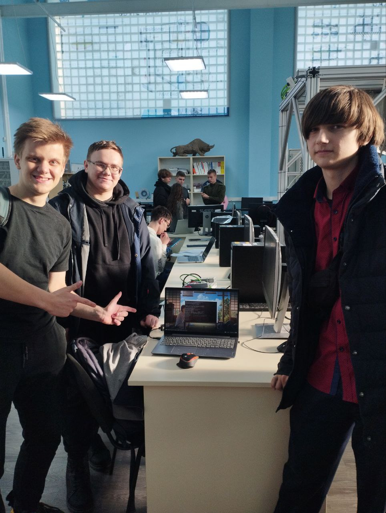

Министерство образования Республики Беларусь  
Учреждение образования   
Брестский Государственный Технический Университет  
Кафедра ИИТ
<br/><br/><br/><br/><br/><br/><br/><br/><br/>
## Лабораторная работа №4
## "Работа с контроллером AXCF 2152"
<br/><br/><br/><br/><br/><br/><br/><br/><br/>
Выполнил:  
Студент 3 курса  
Группы АС-61  
Лис С.С.  

Проверил:
Иванюк Д.С.
<br/><br/><br/><br/><br/><br/><br/><br/><br/>
Брест 2023

---

### Цель работы: Ознакомиться с общей информацией о PLCnext, изучить проект ptusa_main, а так же собрать данный проект и запустить его на тестовом контроллере.

## Ход работы:
Для начала требуется собрать файл ptusa_main в Visual Studio. Чтобы собрать файл для начала необходимо клонировать репозиторий, для этого прописываем команду:

```cmd
git clone --recurse-submodules https://github.com/savushkin-r-d/ptusa_main.git 
```

Далее следуя инструкциям из [репозитория](https://github.com/savushkin-r-d/ptusa_main/tree/master/russian_readme#%D0%BA%D0%B0%D0%BA-%D1%81%D0%BE%D0%B1%D1%80%D0%B0%D1%82%D1%8C-%D0%BF%D1%80%D0%BE%D0%B5%D0%BA%D1%82) собираем проект.

Получаем файл ptusa_main.


После того, как получили файл, подключаемся к контроллеру через LAN соединение. Это было уже проведено в предыдущей [лабораторной работе](https://github.com/brstu/TMAU-2023/tree/main/trunk/as0006112/task_03/doc).


В результате закидываем на контроллер файлы через программу WinSCP полученные в ходе лабораторной работы.



Запускаем исполняемый файл через Putty.





### Вывод: В ходе лабораторной работы была изученая общая информация о платформе PLCnext и запущен проект ptusa_main на контроллере.
