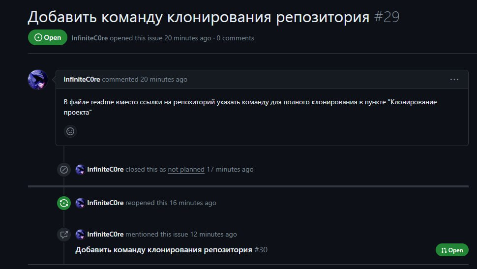
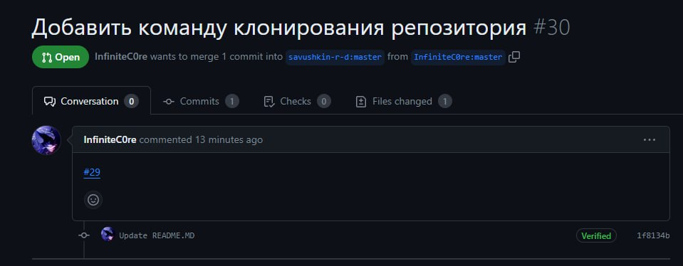
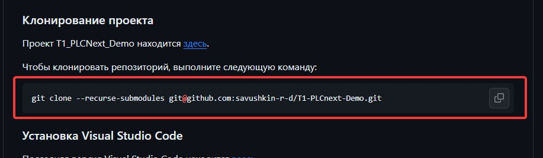

Министерство образования Республики Беларусь  
Учреждение образования   
Брестский Государственный Технический Университет  
Кафедра ИИТ
         
## Лабораторная работа №6
## "Работа с открытыми проектами"
         
Выполнил:  
Студент 3 курса  
Группы АС-61  
Лис С.С.  

Проверил:
Иванюк Д.С.
         
Брест 2023

## Цель работы:  
Изучить предложенные проекты и внести свой вклад в проект (в виде оформления вопросов через issues и внесения изменений через pull request)
## Ход работы  
В ходе изучения предложенных проектов, в документации одного из них была добавлена команда для клонирования репозитория в readme.md для удобного использования. Создал issue, в котором указал на найденный мной [недочёт](https://github.com/savushkin-r-d/T1-PLCnext-Demo/issues/29). Создал [pull request](https://github.com/savushkin-r-d/T1-PLCnext-Demo/pull/30) в котором упомянул issue который он исправляет.

## Вывод:
В ходе лабораторной работы были внесены изменения в предложенные репозитории, а именно в [T1-PLCnext-Demo](https://github.com/savushkin-r-d/T1-PLCnext-Demo).
