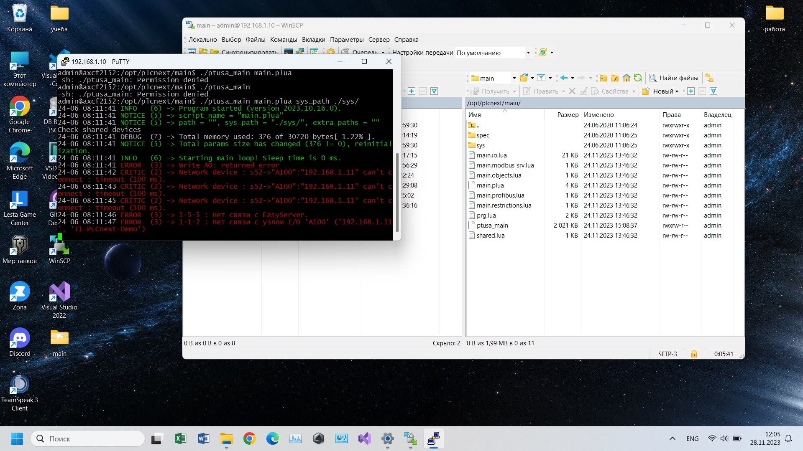

<p align="center"> Министерство образования Республики Беларусь</p>
<p align="center">Учреждение образования</p>
<p align="center">“Брестский Государственный технический университет”</p>
<p align="center">Кафедра ИИТ</p>
<br><br><br>
<p align="center">Лабораторная работа №4</p>
<p align="center">По дисциплине “Теория и методы автоматического управления”</p>
<p align="center">Тема: “Работа с контроллером AXC F 2152”</p>
<br><br><br>
<p align="right">Выполнил:</p>
<p align="right">Студент 3 курса</p>
<p align="right">Группы АС-61</p>
<p align="right">Павлючик А.С.</p>
<p align="right">Проверил:</p>
<p align="right">Старший преподаватель</p>
<p align="right">Иванюк Д.С.</p>
<br><br><br>
<p align="center">Брест 2023</p>

---

<p> <strong>Цель:</strong> собрать его тестовый прокт ptusa_main и продемонстрировать работоспособность на тестовом контроллере.</p>

<p> <strong>Ход работы (СОВМЕСТНО С СЕДКО И МАТИЕВСКОЙ):</strong> </p>
<p>Для решения поставленной задачи, для начала необходимо собрать файл <em>ptusa_main</em> в Visual Studio. Чтобы собрать файл для начала необходимо клонировать репозиторий, для этого используются следующая команда:</p>

 ``` bash
git clone --recurse-submodules https://github.com/savushkin-r-d/ptusa_main.git 
```

<p>После того как клонировали репозиторий, собираем проект.</p>

<p align="center">

<p>Получаем файл <em>ptusa_main</em>.</p>

<p align="center">

<p>После того, как собрали исполняемый файл, подключаемся к контроллеру через Ithernet соединение. Данная процедура была проведена в лабораторной №3. </p>

``` bash
https://github.com/brstu/TMAU-2023/tree/main/trunk/as0006113/task_03/doc
```

<p>После подключения и проверки, запускаем исполняемый файл. </p>

<p align="center">
<p align="center">