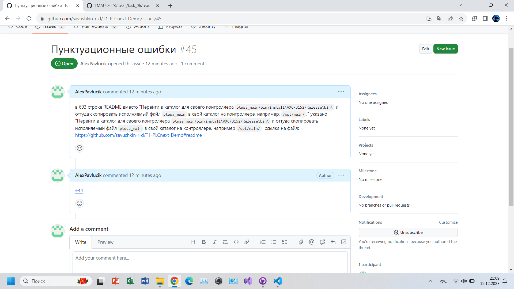
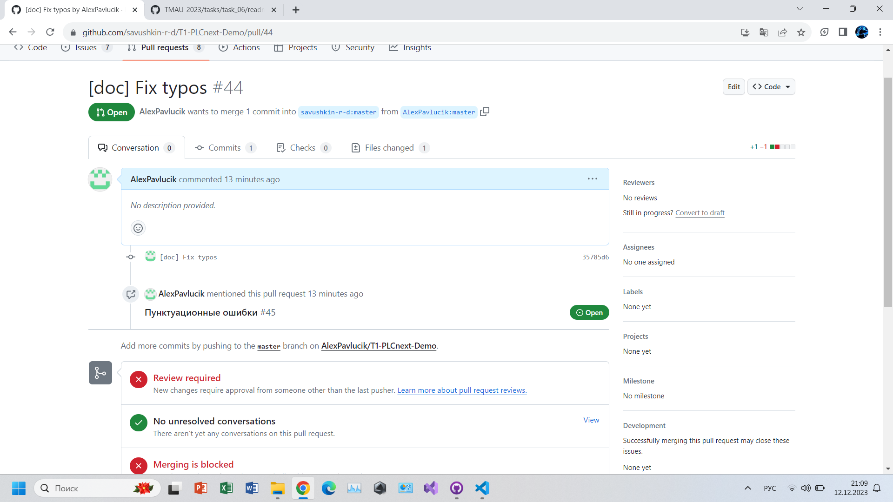

 Министерство образования Республики Беларусь

Учреждение образования

“Брестский Государственный технический университет”

Кафедра ИИТ

   

Лабораторная работа №6

По дисциплине “Теория и методы автоматического управления”

Тема: “Работа с открытыми проектами”

   

Выполнил:

Студент 3 курса

Группы АС-61

Павлючик А.С.

Проверил:

Старший преподаватель

Иванюк Д.С.

   

Брест 2023

---

 <strong>Цель:</strong> проверка открытых проектов, исправление и внесение предложений в проекты

 <strong>Ход работы:</strong> 

Для решения поставленной задачи, небходимо скачать нужный репозиторий, в дальнейшем найти ошибки, внести изменения и предложения.

В ходе проверок в проекте [T1-PLCnext-Demo] (https://github.com/savushkin-r-d/T1-PLCnext-Demo) была найдена ошибка в пунктуации. В последующем отображена в вопросе issue и был отправлен запрос на внесение изменений pull request.

