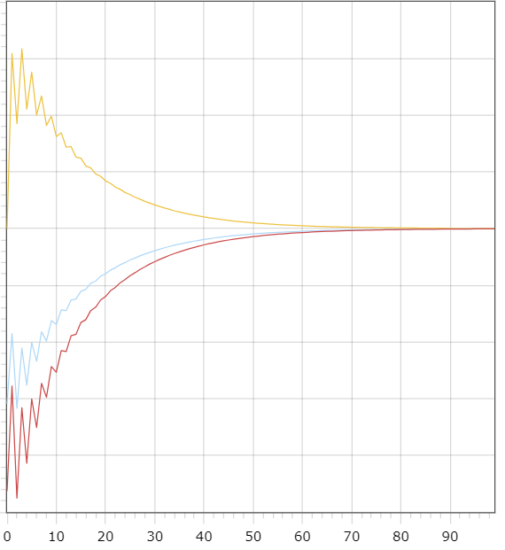
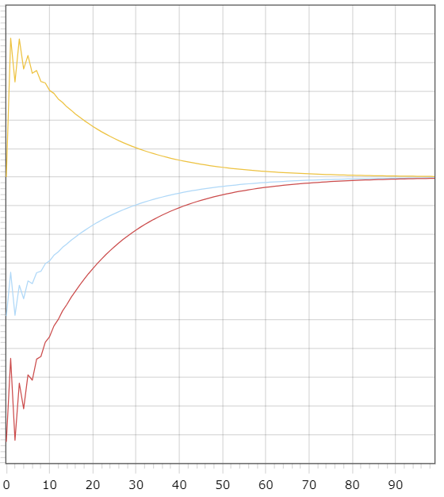

# Лабораторная работа №2 "ПИД-регуляторы"   
Выполнил: Поцелуйко М.А.  
Проверил: Иванюк Д.С.  
## Цель работы:  
На C++ реализовать программу, моделирующую ПИД-регулятор. В качестве объекта управления использовать математическую модель, полученную в предыдущей работе. Использовать ООП, в программе должно быть не менее 3-х классов (+наследование). В отчете также привести графики для разных заданий температуры объекта, пояснить полученные результаты (отчет получать с помощью Doxygen в .md формате).  
## Ход работы  
Была реализована программа, моделирующая ПИД-регулятор. Документацию подготовил с помощью Doxygen. Находится в файле doxygendoc.md. 
Результаты работы:
## Результаты  
### Линейная модель:  
При следующих значениях: T = 10, TP = 10, TM = 50, K = 0.1  
Желаемое значение W = 5, A = 0.333, B = 0.667  

### Нелинейная модель: 
При следующих значениях: T = 10, TP = 10, TM = 50, K = 0.1  
Желаемое значение W = 5, A = 1, B = 0.0033, C = 0.525, D = 0.525   
