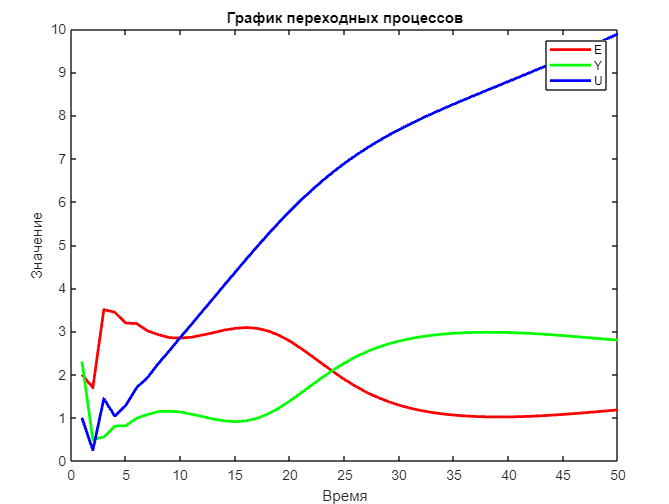

 Министерство образования Республики Беларусь

Учреждение образования

“Брестский Государственный технический университет”

Кафедра ИИТ

       

Лабораторная работа №2

По дисциплине “Теория и методы автоматического управления”

Тема: “ПИД-регуляторы”

     

Выполнил:

Студент 3 курса

Группы АС-61

Рыжко С. И.

Проверил:

Иванюк Д. С.

     

Брест 2023

---

## Цель работы:

На C++ реализовать программу, моделирующую ПИД-регулятор. В качестве объекта управления использовать математическую
модель, полученную в предыдущей работе. Использовать ООП, в программе должно быть не менее 3-х классов (+наследование).
В отчете также привести графики для разных заданий температуры объекта, пояснить полученные результаты (отчет получать с
помощью Doxygen в .md формате).

## Ход работы

Реализовали программу, моделирующую ПИД-регулятор. Документировали код с помощью утилиты Doxygen, документация потом
была преобразована в формат Markdown с помощью Moxygen. Результаты работы модели регулятора записали в файл results.txt.

## Результаты

### Линейная модель

Значения: T = 10, T0 = 10, TD = 40, K = 0.1, want = 5, a = 0.2, b = 0.5.

### Нелинейная модель

Значения: T = 10, T0 = 10, TD = 40, K = 0.1, want = 5, a = 1, b = 0.5, c = 0.3, d = 0.5.

