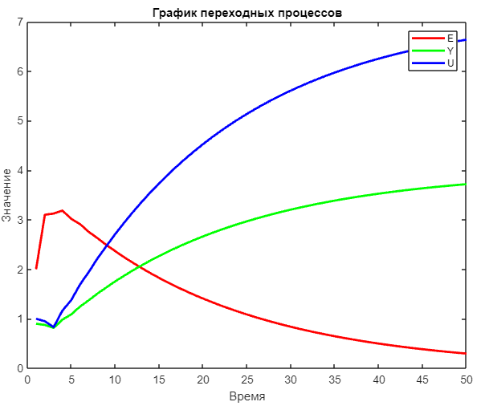

 Министерство образования Республики Беларусь

Учреждение образования

“Брестский Государственный технический университет”

Кафедра ИИТ

       

Лабораторная работа №2

По дисциплине “Теория и методы автоматического управления”

Тема: “ПИД-регуляторы”

     

Выполнил:

Студент 3 курса

Группы АС-61

Рыжко С. И.

Проверил:

Иванюк Д. С.

     

Брест 2023

---

## Кафедра ИИТ

### Лабораторная работа №3

По дисциплине “Теория и методы автоматического управления” Тема: “Работа с контроллером AXC F 2152”

**Выполнил**:
Студент 3 курса
Группы АС-61
Рыжко С.И.
**Проверил**:
Иванюк Д.С.

#### Цель работы:

На C++ реализовать программу, моделирующую ПИД-регулятор. В качестве объекта управления использовать математическую
модель, полученную в предыдущей работе. Использовать ООП, в программе должно быть не менее 3-х классов (+наследование).
В отчете также привести графики для разных заданий температуры объекта, пояснить полученные результаты (отчет получать с
помощью Doxygen в .md формате).

Используя средства ООП (классы + наследование) в языке программирования C++ смоделировать простейший ПИД регулятор. За ОУ взять мат. модель из  [предыдущей лобораторной работы](https://github.com/brstu/TMAU-2023/tree/main/trunk/as0006115/task_01). В докладе о проделанной работе привести графики для разный значений температуры, сформировать отчёт в формате .md с помощью утилиты Doxygen.

#### Ход работы

Для того чтобы демонстрации ОО подхода в C++, изначальый класс модели из первой работы декомпозировал на абстрактный класс `Model` и его подклассы `Linear` и `NonLinear`, сам регулятор так же реализован с помощью класса `Regulator` предоставляющим метод `calculateControlSignal`.

 Код документирован с помощью Doxygen и переведён в формат Markdown с помощью утилиты Moxygen. Для этого:
 1. Создаём файл конфигурации Doxygen
 `doxygen -g`
 2. Ставим опцию генерации XML в YES
 `GENERATE_XML           = YES`
 3. Скачиваем и запускам `moxygen`
 `npm install moxygen -g && moxygen --anchors -o docs -f markdown`

#### Результаты

Линейная модель при значениях: 
T = 10, T0 = 10, TD = 40, K = 0.1, want = 5, a = 0.2, b = 0.5.

Нелинейная модель при значениях: 
T = 10, T0 = 10, TD = 40, K = 0.1, want = 5, a = 1, b = 0.5, c = 0.3, d = 0.5.

