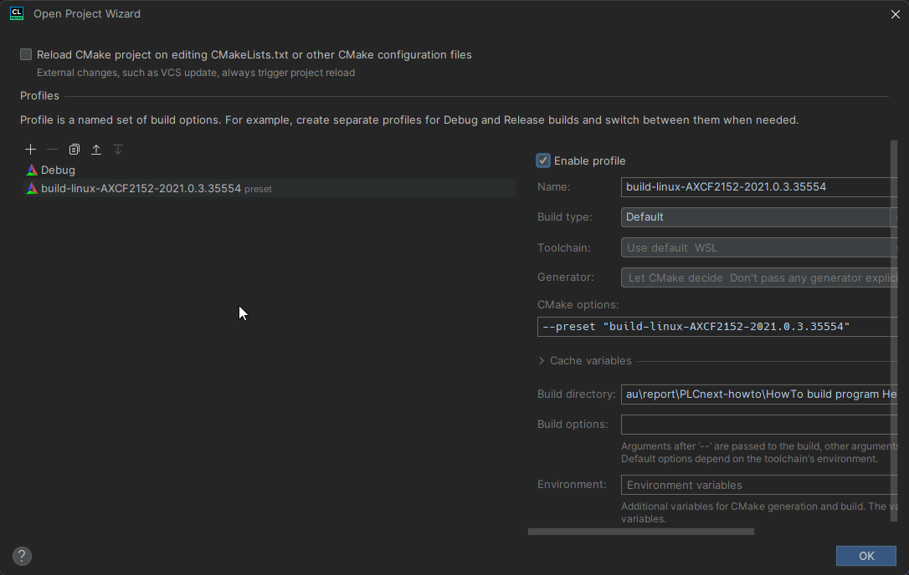
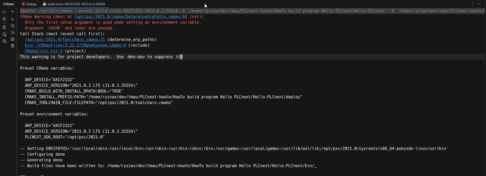
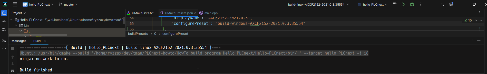
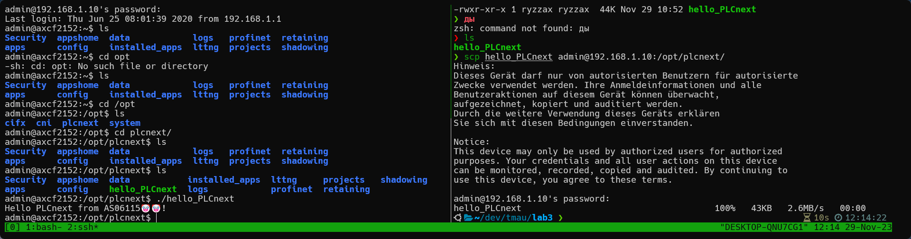

## Цель


Ознакомиться с платформой PLCnext, изучить руководство, создать тестовый проект "Hello PLCnext from AS0xxyy!" использованием Visual Code, собрать его и продемонстрировать его выполнение на тестовом контроллере AXC F 2152.

## Ход работы

Клонируем репозиторий с проектов Hello PLCnext с помощью команды:

```bash
git clone https://github.com/savushkin-r-d/PLCnext-howto/tree/master 
```

1. Сборку выполним с помощью встроенных средств поддержки CMake в IDE CLion
	1. Подключение профиля CMake для сборки на Linux
    
	2. Конфигурация:
	   
	3. Сборка:
	   
	4. На выходе получим исполняемый файл hello_PLCnext
	   
2. Далее запустим файл на контроллере.
На изображении снизу показан процесс передачи и запуска файла на контроллере. Правая панель терминала показывает результат выполнения команды `scp` с помощью которой файл передаётся. В панели слева выполнен вход в контроллер по `ssh` и показывается результат выполнения программы.
    


**Вывод:** В ходе выполнения данной лабораторной работы были получены знания для работы с контроллером _AXC F 2152_.
