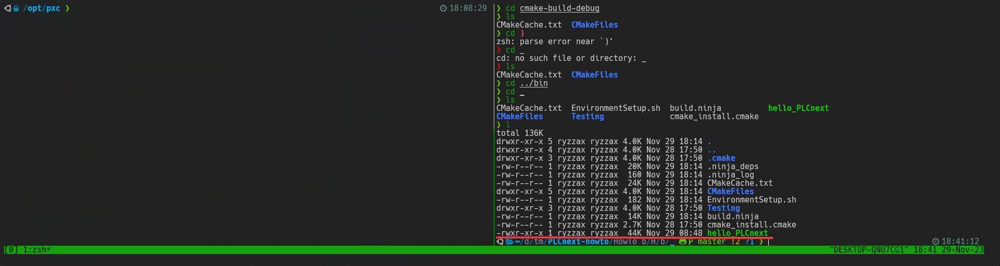

<p align="center"> Министерство образования Республики Беларусь</p>
<p align="center">Учреждение образования</p>
<p align="center">“Брестский Государственный технический университет”</p>
<p align="center">Кафедра ИИТ</p>
<br><br><br>
<p align="center">Лабораторная работа №3</p>
<p align="center">По дисциплине “Теория и методы автоматического управления”</p>
<p align="center">Тема: “Работа с контроллером AXC F 2152”</p>
<br><br><br>
<p align="right">Выполнил:</p>
<p align="right">Студент 3 курса</p>
<p align="right">Группы АС-61</p>
<p align="right">Рыжко С.И.</p>
<p align="right">Проверил:</p>
<p align="right">Старший преподаватель</p>
<p align="right">Иванюк Д.С.</p>
<br><br><br>
<p align="center">Брест 2023</p>

---
## Цель

Ознакомиться с платформой PLCnext, изучить руководство, создать тестовый проект "Hello PLCnext from AS0xxyy!" использованием Visual Code, собрать его и продемонстрировать его выполнение на тестовом контроллере AXC F 2152.

## Ход работы

Клонируем репозиторий с проектов Hello PLCnext с помощью команды:

```bash
git clone https://github.com/savushkin-r-d/PLCnext-howto/tree/master 
```

1. Сборку выполним с помощью встроенных средств поддержки CMake в IDE CLion
   1. Подключаем профиль CMake для сборки.
    
   2.  Результат конфигурации.
	   
   3. Собираем проект.
	   
   4. На выходе получим исполняемый файл hello_PLCnext.
	   
2. Далее запустим файл на контроллере.
На изображении снизу показан процесс передачи и запуска файла на контроллере. Правая панель терминала показывает результат выполнения команды `scp` с помощью которой файл передаётся. В панели слева выполнен вход в контроллер по `ssh` и показывается результат выполнения программы.
    


**Вывод:** В ходе выполнения данной лабораторной работы были получены знания для работы с контроллером _AXC F 2152_.
