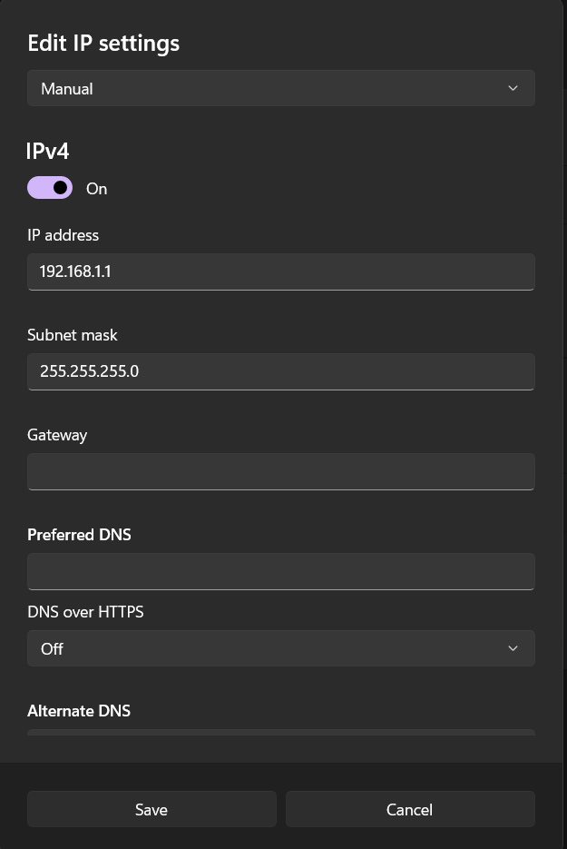

# Министерство образования Республики Беларусь
## Учреждение образования
## *“Брестский Государственный технический университет”*
### Кафедра ИИТ
<br><br><br>

**Лабораторная работа №3**

По дисциплине “Теория и методы автоматического управления”
Тема: “Работа с контроллером AXC F 2152”
<br><br><br>

Выполнил:<br>
Студент 3 курса<br>
Группы АС-61<br>
Рыжко С.И.<br>
Проверил:<br>
Иванюк Д.С.
<br><br><br>

Брест 2023

---
## Цель

- Ознакомиться с платформой PLCnext.
- Изучить руководство по использованию платформы.
- Создать тестовый проект с названием "Hello PLCnext from AS0xxyy!".
- Собрать проект и продемонстрировать его выполнение на тестовом контроллере AXC F 2152.

## Ход работы

Клонируем репозиторий с проектов Hello PLCnext с помощью команды:

```bash
git clone https://github.com/savushkin-r-d/PLCnext-howto/tree/master 
```

1. Сборку выполним с помощью встроенных средств CMake в IDE CLion
   1. Подключаем профиль CMake для сборки.
    
   2.  Результат конфигурации профиля.
	   
   3. Собираем проект.
	   
   4. На выходе получим исполняемый файл hello_PLCnext.
	   
2. Далее запустим файл на контроллере.
Приведенное ниже изображение демонстрирует процесс передачи и запуска файла на контроллере. В правой панели терминала виден результат выполнения команды scp, которая используется для передачи файла на контроллер по протоколу SSH. В левой панели показано подключение к контроллеру и результат выполнения программы.
    

В ходе выполнения работы я столкнулся с проблемой подключения контроллера к ноутбуку посредством Ethernet. Несмотря на правильное подключение кабеля, контроллер не обнаруживался в списке доступных сетевых устройств.

Для решения данной проблемы я решил проверить настройки сетевых адаптеров на ноутбуке. Оказалось, что настройки Ethernet-адаптера были несколько искажены. Тщательно изучив документацию контроллера, я установил необходимые настройки сетевого соединения на ноутбуке, согласно рекомендациям производителя.

После внесения необходимых изменений в настройки сетевого адаптера, контроллер успешно подключился к ноутбуку посредством Ethernet. Это позволило мне продолжить выполнение лабораторных задач и успешно завершить проект.




**Вывод**: В результате выполнения данной лабораторной работы были приобретены навыки работы с контроллером AXC F 2152.


