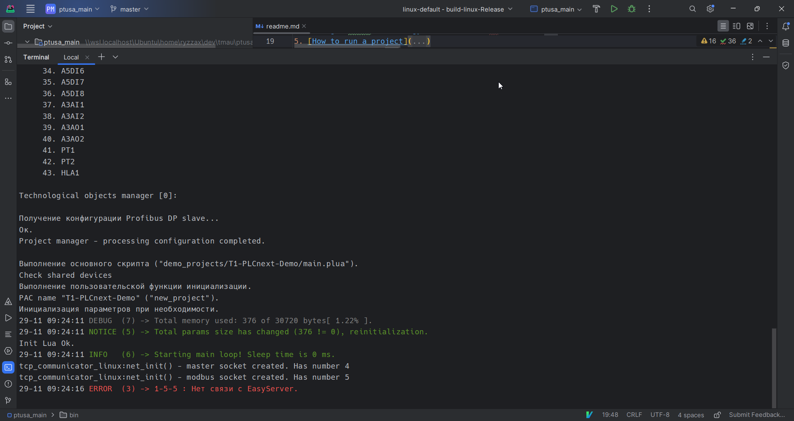

 Министерство образования Республики Беларусь

Учреждение образования

“Брестский Государственный технический университет”

Кафедра ИИТ

   

Лабораторная работа №4

По дисциплине “Теория и методы автоматического управления”

Тема: “Работа с контроллером AXC F 2152”

   

Выполнил:

Студент 3 курса

Группы АС-61

Рыжко С.И.

Проверил:

Старший преподаватель

Иванюк Д.С.

   

Брест 2023

---
## Цель

Собрать проект [ptusa_main](https://github.com/savushkin-r-d/ptusa_main) и продемонстрировать его работоспособность на контроллере.

## Ход работы

1. Клонируем проект https://github.com/savushkin-r-d/ptusa_main и собираем в исполняемый файл.
   
2. Переносим исполняемый файл вместе с демо проектом T1-PLCnext-Demo в файловую систему контроллера с помощью `scp` как это было сделано в [лабораторной работе №3](https://github.com/ryzzax21/TMAU-2023/tree/task_03/trunk/as0006115/task_03).
3. Запускаем бинарный файл в сессии `ssh` с помощью команды `./ptusa_main  main.plua  sys_path ./sys/`
	

