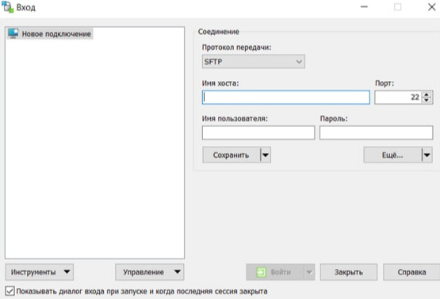
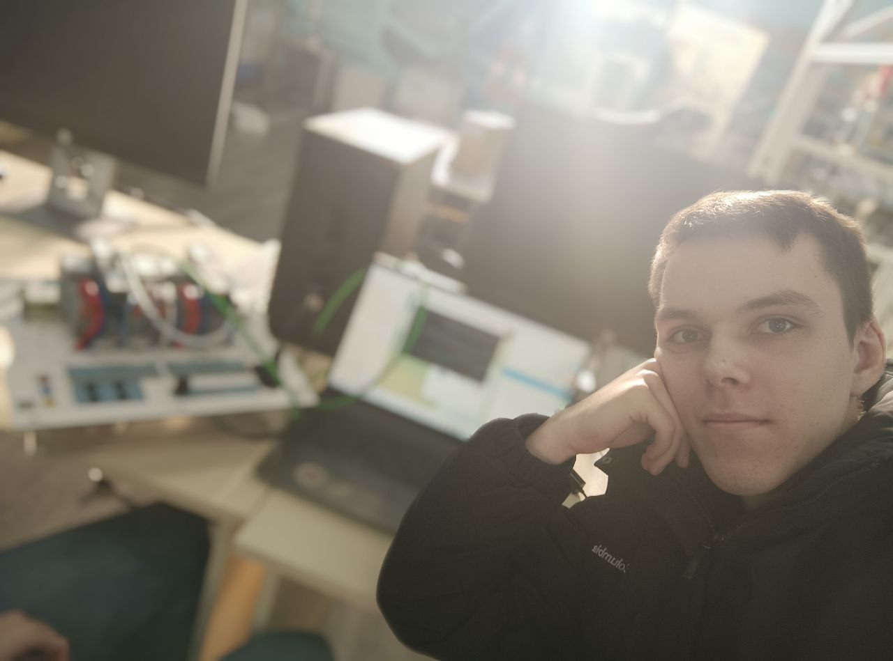
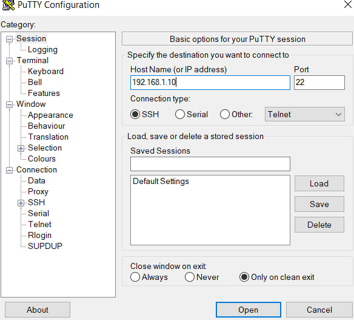
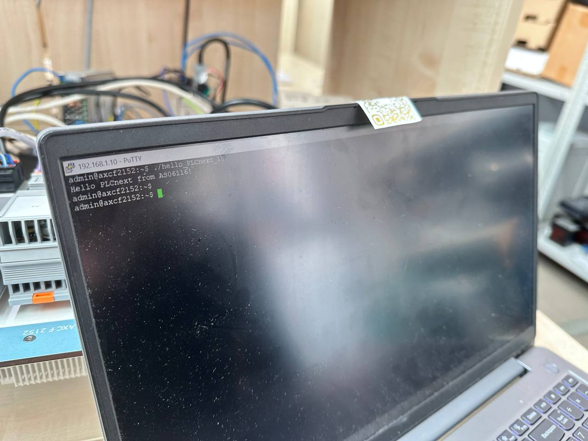

 Министерство образования Республики Беларусь

 Учреждение образования

 “Брестский Государственный технический университет”

 Кафедра ИИТ

       

 Лабораторная работа №3

 По дисциплине “Теория и методы автоматического управления”

 Тема: “Работа с контроллером AXC F 2152”

     

 Выполнил:

 Студент 3 курса

 Группы АС-61

 Седко М.В.

 Проверил:

 Иванюк Д. С.

     

 Брест 2023

---

## Цель работы:  
 Используя Visual Code создать тестовый проект "Hello PLCnext from AS06116!", собрать его и продемонстрировать работоспособность на тестовом контроллере.
## Ход работы
 Собрал исполняемый файл используя [руководство](https://github.com/savushkin-r-d/PLCnext-howto/tree/master/HowTo%20build%20program%20Hello%20PLCnext). Настромл параметры сети своего компьютера.

 

 Пришёл в лабораторию, настроил и подключил контроллер через провод Ethernet к компьютеру.

 Включил PuTTY и поключился к контроллеру.

 Открыл WinCP и запустил программу.

## Основные проблемы с которыми я столкнулся
 Главной проблемой при сборке стало удаление неправильно установленного SDK. [Решение проблемы](https://www.plcnext-community.net/forum/#/discussion/2428/i-encountered-an-error-when-creating-a-visualstudio-project-plcnext) я нашёл на официальном форуме PLCnext Technology. Также проблемой стало отсутсвие переходника для подключения контроллера к своему компьютеру.
