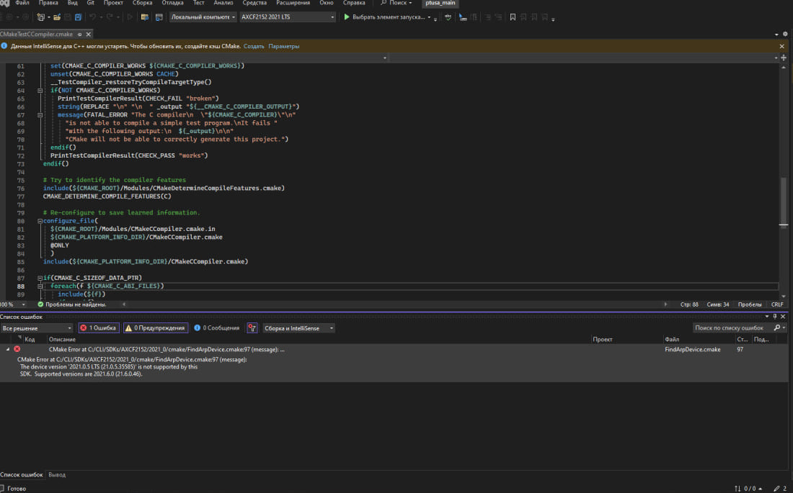

 Министерство образования Республики Беларусь

 Учреждение образования

 “Брестский Государственный технический университет”

 Кафедра ИИТ

       

 Лабораторная работа №4

 По дисциплине “Теория и методы автоматического управления”

 Тема: “Работа с контроллером AXC F 2152”

     

 Выполнил:

 Студент 3 курса

 Группы АС-61

 Седко М.В.

 Проверил:

 Иванюк Д. С.

     

 Брест 2023

---
## Ход работы:
1. Клонировал репозиторий "savushkin-r-d/ptusa_main" на компьютер и собрал исполняемый файл "ptusa_main". 

 

2. Вместе с одногрупниками пришёл в лабораторию и выполнил действия, необходимые для проверки работоспособности проекта на контроллере. Данные действия описаны в [лабораторной раборте №3](https://github.com/brstu/TMAU-2023/blob/main/trunk/as0006116/task_03/doc/readme.md).

 

3. Запустил исполняемый файл "ptusa_main" следующей командой "./ptusa_main  main.plua  sys_path ./sys/".

 

## Проблемы, которые я решал по ходу выполнения работы 
 Главной проблемой при сборке стало отсутствие на официальном сайте PLCnext Technology необходимого для проекта SDK. Для решение проблемы пришлось вручную искать и менять в настройках CMake версию SDK.

  

## Вывод
 В ходе лабораторной работы я получил опыт работы в команде, повысил свои навыки работы с системой Git и платформой GitHub, собрал и проверил работоспособность проета ptusa_main, получил опыт работы с контроллером. 
