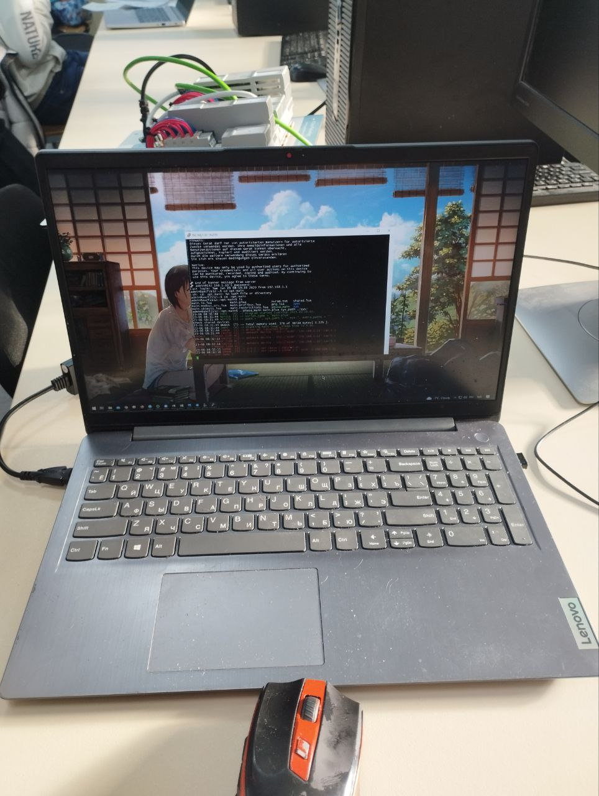

# Министерство образования Республики Беларусь
## Учреждение образования
### “Брестский Государственный технический университет”
#### Кафедра ИИТ

---

# Лабораторная работа №4
## По дисциплине “Теория и методы автоматического управления”
### Тема: “Работа с контроллером AXC F 2152”

---

**Выполнил:**
Студент 3 курса
Группы АС-61
Чугарин Д.А.

**Проверил:**
Старший преподаватель
Иванюк Д.С.

---

# Брест 2023

---
<p> <strong>Цель: </strong>используя среду разработки Visual Studio собрать проект и запустить проект на тестовом контроллере.</p> 

<p> <strong>Ход работы:</strong> </p>

По заданию, клонируем репозиторий [ptusa_main](https://github.com/savushkin-r-d/ptusa_main).

Мы открываем этот репозиторий в Visual Studio, что позволяет нам создать проект на основе CMake. 
С помощью Visual Studio мы компилируем этот проект. 
Затем мы подключаемся к контроллеру, следуя тем же шагам, что и в 3-й лабораторной работе.

[task_03](../../task_03/doc/readme.md).

<p>Переходим в папку с проектом и запускаем нашу программу:</p>

``` bash

./ptusa_main  main.plua  sys_path  ./sys/

```

**Console Output:**





**Вывод:** В ходе выполнения этой лабораторной работы были освоены навыки работы в среде Visual Studio. Проект был успешно собран, что позволило получить дополнительный опыт работы с тестовым контроллером AXC F 2152.