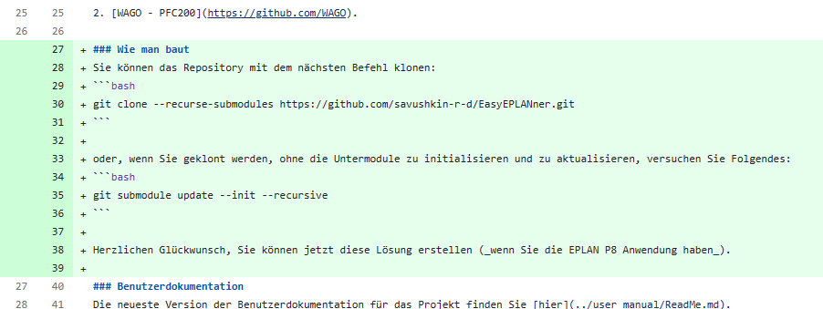

Лабораторная работа №6

Выполнил: Чугарин Даннил АС-61

Проверил: Иванюк Д.С

### Цель работы:
Внести свой вклад в проект (в виде оформления вопросов (issue) и запросов на внесение изменений (pull request)):
- предложить исправления в ошибках в документации (синтаксические, орфографические и т.п.);
- предложить исправления в исходном коде;
- предложить новую функциональность.

### Ход работы:
Добавил немецкую версию How to build а так же блоки кода для клонирования репозитория.
Для начала было созданно [issue](https://github.com/savushkin-r-d/EasyEPLANner/issues/1277)

Далее создал [pull request](https://github.com/savushkin-r-d/EasyEPLANner/pull/1285) для внесения изменений в репозиторий.

### Вывод:
Входе лабораторной работы я внёс изменения в репозиторий [EasyEPLANner](https://github.com/savushkin-r-d/EasyEPLANner).
