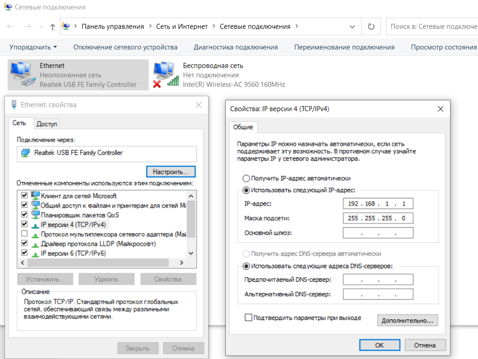
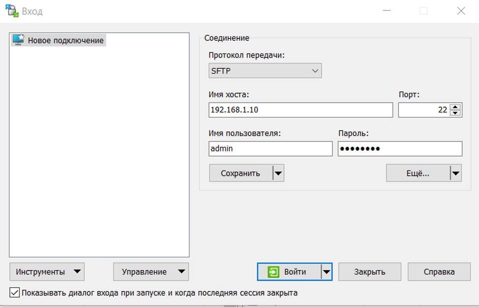
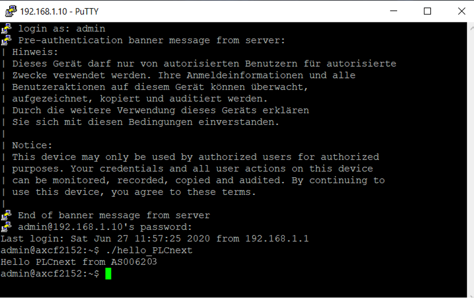
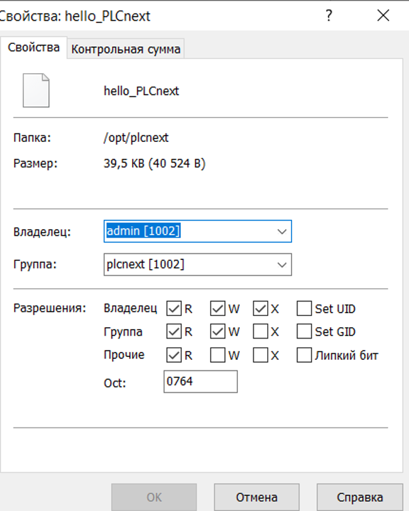

Министерство образования Республики Беларусь

Учреждение образования Брестский Государственный Технический Университет

Кафедра ИИТ

         

## Лабораторная работа №3

## "Работа с контроллером AXC F 2152"

         

Выполнил:

Студент 3 курса

Группы АС-62

Венчагов Д.А.

Проверил:

Cтарший преподаватель:

Иванюк Д.С.

         

Брест 2023

 Цель работы: Используя Visual Code создать тестовый проект "Hello PLCnext from AS0xxyy!", собрать его и продемонстрировать работоспособность на тестовом контроллере.

 Ход работы:

 1. После клонирования репозитория собираем наш файл по инструкции указанной в репозитории 

 1.1. Настройка перед сборкой файла:

cmake --preset=build-windows-AXCF2152-2021.0.3.35554

 1.2. Сборка файла:

cmake --build --preset=build-windows-AXCF2152-2021.0.3.35554 --target all

 1.3. Установка собранного файла:

cmake --build --preset=build-windows-AXCF2152-2021.0.3.35554 --target install

 В результате выполнения наших команд получим необходимый файл hello_PLCnext

 2.После сборки нашего файла,необходимо подключить наш контролер,для этого мы в свойствах Ethernet меняем ip на 192.168.1.1,маску подсети остаётся по умолчанию 255.255.255.0

 3.Проверяем подключение к контроллеру с помощью команды ping 192.168.1.1,чтобы убедится,что подключение стабильное и без перебоев

 4.Подключаемся с помощью WinScp,вводя логин и пароль,находящийся на контролере

 5.Добавляем наш собранный файл на контролер,меняя при этом его разрешения для владельца

 6.Входим в систему с помощью программы Putty вводя логин:admin и пароль,указанный на контролере

 7.Открываем наш собранный бинарный файл

 Вывод: в ходе проведённой работе мы получили базовые данные для работы с контролером AXC F 2152,возникали проблемы с подключением, которые решили неоднократным переподключением контролера,наибольшую трудность представила сборка бинарного файла.Первый опыт работы с контролером можно считать успешным
