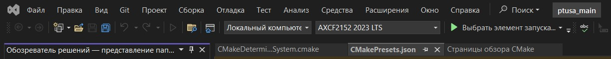
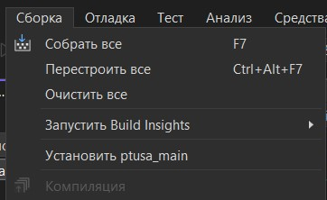
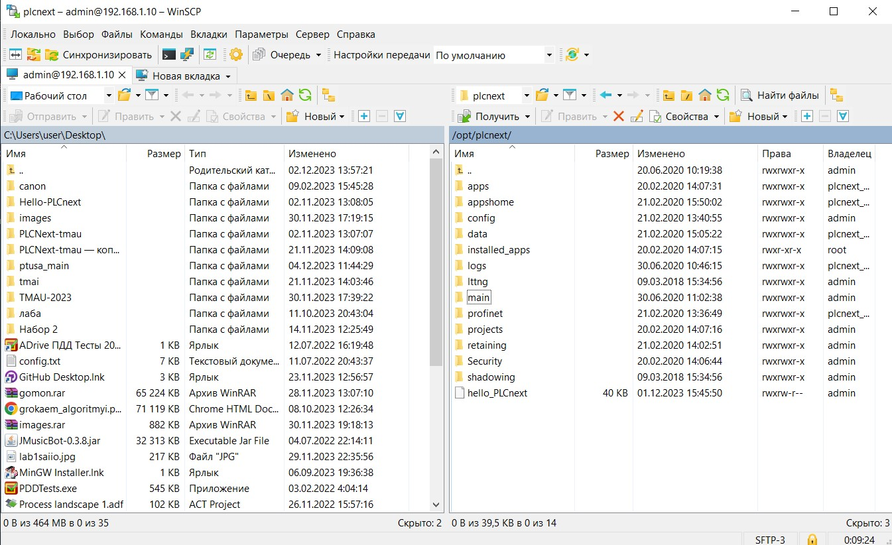
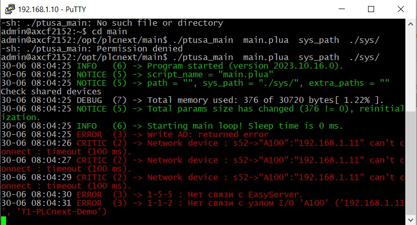
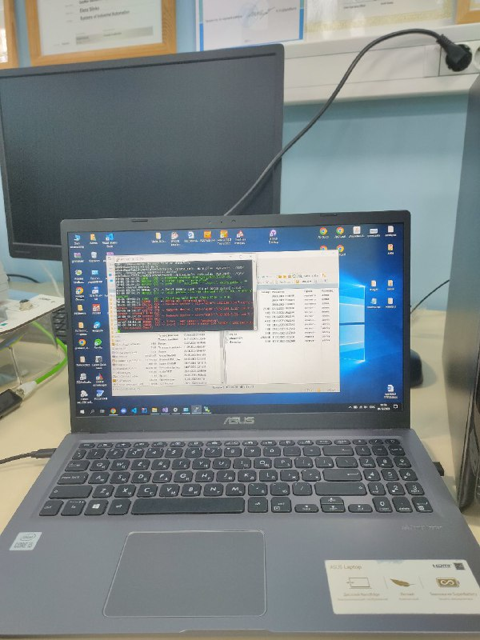

 Министерство образования Республики Беларусь

Учреждение образования

“БрГТУ”

Кафедра интеллектуальных информационных технологий

   

Лабораторная работа №4

По дисциплине “ТиМАУ”

Тема: “Работа с контроллером AXC F 2152”

   

Выполнил:

Студент 3 курса

Группы АС-62

Гомон М.Д.

 

Проверил:

Иванюк Д.С.

   

Брест 2023

---

 <strong> Цель </strong> Используя Visual Studio собрать проект ptusa_main и продемонтрировать работоспособность на котроллере 

Задание: [#4] (../../../../tasks/task_04/readme.md) 

 <strong> Решение </strong> 

Копируем репозиторий проекта используя команду <em> git clone --recurse-submodules https://github.com/savushkin-r-d/ptusa_main.git </em> 

Запускаем репозиторий в <em> Visual Studio </em> и после этого собираем проект при помощи Cmake. При сборке возникла следующая ошибка <em>c:/CLI/sdks/AXCF2152/2022_0/sysroots/x86_64-w64-mingw32/usr/bin/arm-pxc-linux-gnueabi/arm-pxc-linux-gnueabi-gcc.exe</em> Проблема решается обновлением  SDK до версии 2023.6.0.43 
 

Выбираем сборку <em>AXCF2152-2023 LTS</em>

Собираем проект

В результате получаем Каталог <em>AXCF2152_2022_0 </em> в котором хранится файл <em>ptusa_main</em> 

Далее подключаемся к контроллеру, проверяем подключение, авторизируемся в <em>Putty Configuration</em> и <em>WinSCP</em> создаем каталог <em>main</em> в котором будут находиться нужные файлы для запуска программы 

В <em>Putty</em> вводим  команды <em>./ptusa_main  main.plua  sys_path  ./sys/</em> и в результате получаем: 

<strong>Вывод </strong>Используя Visual Studio собрали проект и продемонстрировали работоспособность на контроллере. 

