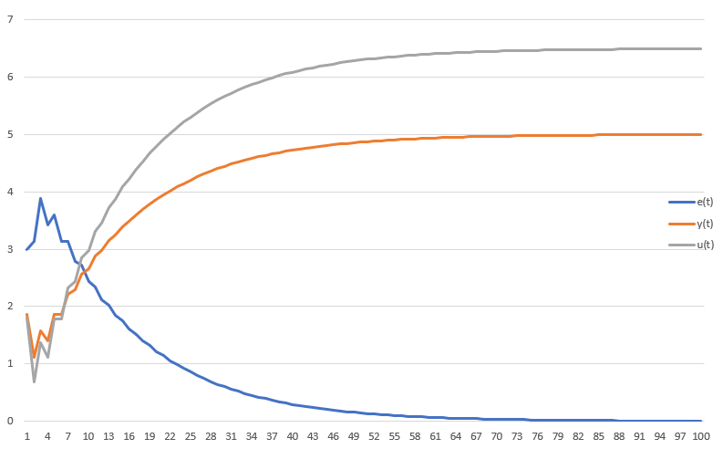
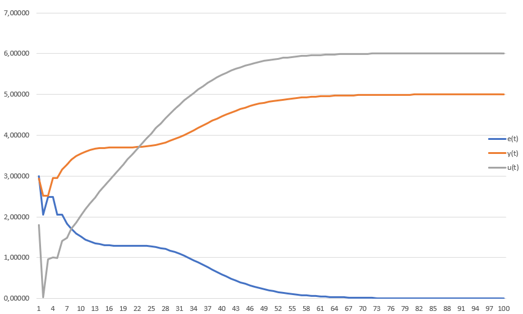

# Лабораторная работа №2 "ПИД-регуляторы"   
Выполнил: Дмитраница В.П.   
Проверил: Иванюк Д.С.  
## Цель работы:  
На C++ реализовать программу, моделирующую ПИД-регулятор. В качестве объекта управления использовать математическую модель, полученную в предыдущей работе. Использовать ООП, в программе должно быть не менее 3-х классов (+наследование). В отчете также привести графики для разных заданий температуры объекта, пояснить полученные результаты (отчет получать с помощью Doxygen в .md формате).  
## Ход работы  
Реализовал программу, моделирующую ПИД-регулятор. Документация была сделана с помощью Doxygen, были получены XML-файлы, которые затем были конвертированы в один md файл. Документация находится в файле doxygendoc.md. 
А в этом файле я покажу результаты работы программы.  
## Результаты  
### По линейной модели:  
При следующих значениях: T = 10, T0 = 10, TD = 50, K = 0.1  
Желаемое значение w = 5, a = 0.333, b = 0.667  

### По нелинейной модели: 
При следующих значениях: T = 10, T0 = 10, TD = 50, K = 0.1  
Желаемое значение w = 5, a = 1, b = 0.0033, c = 0.525, d = 0.525   

