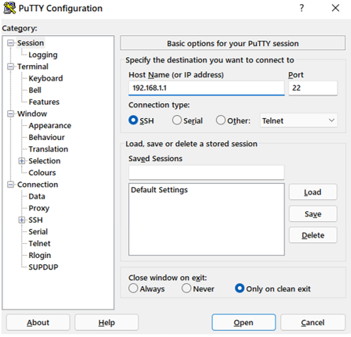

Министерство образования Республики Беларусь

Учреждение образования

“Брестский Государственный технический университет”

Кафедра ИИТ

       

Лабораторная работа №3

По дисциплине “Теория и методы автоматического управления”

Тема: “Работа с контроллером AXC F 2152”

     

Выполнил:

Студентка 3 курса

Группы АС-62

Иванищева И.А.

Проверил:

Иванюк Д.С.

     

Брест 2023

---

## Task 3. Работа с контроллером AXC F 2152.:

Используя Visual Code, создайте тестовый проект «Hello PLCnext from AS06208!», соберите его и продемонстрируйте производительность на тестовом контроллере.

### Steps to run:
1. Исходя из указанной цели,клонируем репозиторий а компьютере и собираем исполняемый файл "hello_PLCnext", дальше необходимо собрать проект и показать его работоспособность на контроллере AXC F 2152.

2. Далее нужно подключиться к контроллеру через LAN-кабель, предварительно настроив соединение IPV-4. В свойствах этого соединения нам необходимо указать ip-адрес «192.168.1.1» и маску «255.255.255.0».

3. Для проверки соединения используем команду «ping 192.168.1.10» в командной строке, где «192.168.1.10» — ip-адрес контроллера. Если пакеты не теряются, значит соединение установлено правильно.

4. Устанавливаем на свой компьютер 2 программы: PuTTY и WinSCP..

5. С помощью PuTTY подключаемся к контроллеру, введя ip-адрес контроллера, логин - "admin" и пароль - "785*****".

6. Следующим шагом мы переносим исполняемый файл в корень контроллера с помощью программы WinSCP. Также вводим ip-адрес, логин и пароль контроллера.

7. Далее необходимо изменить права доступа для запуска исполняемого файла.

8. Запуск исполняемого файла.

  
<strong><em>Вывод:</em></strong>

В ходе лабораторной работы мы научились собирать проект для контроллера AXCF 2152 и запускать его на своем устройстве. 
