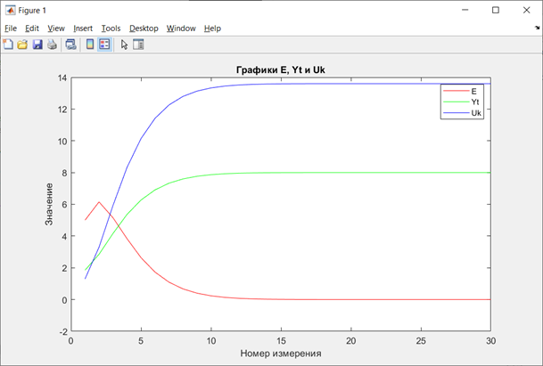
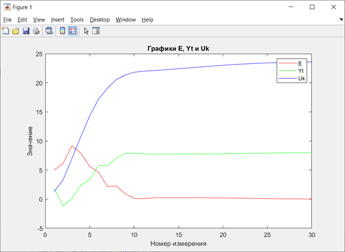

<p align="center"> Министерство образования Республики Беларусь</p>
<p align="center">Учреждение образования</p>
<p align="center">“Брестский Государственный технический университет”</p>
<p align="center">Кафедра ИИТ</p>
<br><br><br>
<p align="center">Лабораторная работа №2</p>
<p align="center">По дисциплине “Теория и методы автоматического управления”</p>
<p align="center">Тема: “ПИД-регуляторы”</p>
<br><br><br>
<p align="right">Выполнил:</p>
<p align="right">Студент 3 курса</p>
<p align="right">Группы АС-62</p>
<p align="right">Кравцов Г.С.</p>
<p align="right">Проверил:</p>
<p align="right">Старший преподаватель</p>
<p align="right">Иванюк Д.С.</p>
<br><br><br>
<p align="center">Брест 2023</p>

---
<p> <strong> Цель: </strong>на C++ реализовать программу, моделирующую ПИД-регулятор. В программе должно быть не менее 3-х классов (+наследование). В отчете также привести графики для разных заданий температуры объекта, пояснить полученные результаты с помощью Doxygen.</p>
<p> <strong> Задание: </strong></p> 

 [#2](../../../../tasks/task_02/readme.md)

<p> <strong> Решение </strong> </p>
<p>Код программы, которая моделирует ПИД-регулятор. 

[main.cpp](../src/Source.cpp).

<p>С помощью Doxygen была создана документация программы в формате rtf, после чего преобразована в формат .md .</p>

[doxygen.md](doxygen.md).

<p>  Линейная модель: </p>

 

<p>  Нелинейная модель:  </p>

 

<p>Вывод результатов программмы в консоль: </p>

``` bash
Input Linear Model's parameters
Input parameter a: 0.5
Input parameter b: 0.2
Input Nonlinear Model's parameters
Input parameter a: 0.4
Input parameter b: 0.6
Input parameter c: 0.1
Input parameter d: 0.4
        Linear Model:
Deviation(E) = 5, Current Temperature(Yt) = 1.76, Control Variable(Uk) = 1.3
Deviation(E) = 6.24, Current Temperature(Yt) = 2.16448, Control Variable(Uk) = 3.3224
Deviation(E) = 5.83552, Current Temperature(Yt) = 2.72777, Control Variable(Uk) = 6.13884
Deviation(E) = 5.27223, Current Temperature(Yt) = 3.29497, Control Variable(Uk) = 8.97486
Deviation(E) = 4.70503, Current Temperature(Yt) = 3.81073, Control Variable(Uk) = 11.5536
Deviation(E) = 4.18927, Current Temperature(Yt) = 4.27256, Control Variable(Uk) = 13.8628
Deviation(E) = 3.72744, Current Temperature(Yt) = 4.68398, Control Variable(Uk) = 15.9199
Deviation(E) = 3.31602, Current Temperature(Yt) = 5.0501, Control Variable(Uk) = 17.7505
Deviation(E) = 2.9499, Current Temperature(Yt) = 5.37583, Control Variable(Uk) = 19.3792
Deviation(E) = 2.62417, Current Temperature(Yt) = 5.6656, Control Variable(Uk) = 20.828
Deviation(E) = 2.3344, Current Temperature(Yt) = 5.92337, Control Variable(Uk) = 22.1169
Deviation(E) = 2.07663, Current Temperature(Yt) = 6.15268, Control Variable(Uk) = 23.2634
Deviation(E) = 1.84732, Current Temperature(Yt) = 6.35667, Control Variable(Uk) = 24.2833
Deviation(E) = 1.64333, Current Temperature(Yt) = 6.53813, Control Variable(Uk) = 25.1907
Deviation(E) = 1.46187, Current Temperature(Yt) = 6.69956, Control Variable(Uk) = 25.9978
Deviation(E) = 1.30044, Current Temperature(Yt) = 6.84316, Control Variable(Uk) = 26.7158
Deviation(E) = 1.15684, Current Temperature(Yt) = 6.9709, Control Variable(Uk) = 27.3545
Deviation(E) = 1.0291, Current Temperature(Yt) = 7.08454, Control Variable(Uk) = 27.9227
Deviation(E) = 0.915464, Current Temperature(Yt) = 7.18562, Control Variable(Uk) = 28.4281
Deviation(E) = 0.814376, Current Temperature(Yt) = 7.27555, Control Variable(Uk) = 28.8778
Deviation(E) = 0.724449, Current Temperature(Yt) = 7.35555, Control Variable(Uk) = 29.2777
Deviation(E) = 0.644453, Current Temperature(Yt) = 7.42671, Control Variable(Uk) = 29.6335
Deviation(E) = 0.57329, Current Temperature(Yt) = 7.49001, Control Variable(Uk) = 29.9501
Deviation(E) = 0.509986, Current Temperature(Yt) = 7.54633, Control Variable(Uk) = 30.2316
Deviation(E) = 0.453671, Current Temperature(Yt) = 7.59642, Control Variable(Uk) = 30.4821
Deviation(E) = 0.403575, Current Temperature(Yt) = 7.64099, Control Variable(Uk) = 30.7049
Deviation(E) = 0.359011, Current Temperature(Yt) = 7.68063, Control Variable(Uk) = 30.9032
Deviation(E) = 0.319368, Current Temperature(Yt) = 7.7159, Control Variable(Uk) = 31.0795
Deviation(E) = 0.284102, Current Temperature(Yt) = 7.74727, Control Variable(Uk) = 31.2363
Deviation(E) = 0.252731, Current Temperature(Yt) = 7.77518, Control Variable(Uk) = 31.3759

        Nonlinear Model
Deviation(E) = 5, Current Temperature(Yt) = 1.33, Control Variable(Uk) = 1.3
Deviation(E) = 6.67, Current Temperature(Yt) = -3.47116, Control Variable(Uk) = 3.4342
Deviation(E) = 11.4712, Current Temperature(Yt) = -3.54035, Control Variable(Uk) = 7.7503
Deviation(E) = 11.5403, Current Temperature(Yt) = -2.52858, Control Variable(Uk) = 12.7357
Deviation(E) = 10.5286, Current Temperature(Yt) = -2.30942, Control Variable(Uk) = 18.2317
Deviation(E) = 10.3094, Current Temperature(Yt) = -2.07161, Control Variable(Uk) = 23.6009
Deviation(E) = 10.0716, Current Temperature(Yt) = -1.72681, Control Variable(Uk) = 28.7289
Deviation(E) = 9.72681, Current Temperature(Yt) = -1.00431, Control Variable(Uk) = 33.7131
Deviation(E) = 9.00431, Current Temperature(Yt) = -0.0565793, Control Variable(Uk) = 38.4438
Deviation(E) = 8.05658, Current Temperature(Yt) = 0.352611, Control Variable(Uk) = 42.8151
Deviation(E) = 7.64739, Current Temperature(Yt) = 0.121013, Control Variable(Uk) = 46.8887
Deviation(E) = 7.87899, Current Temperature(Yt) = 0.977025, Control Variable(Uk) = 50.8381
Deviation(E) = 7.02298, Current Temperature(Yt) = 1.46851, Control Variable(Uk) = 54.5179
Deviation(E) = 6.53149, Current Temperature(Yt) = 1.24543, Control Variable(Uk) = 58.0386
Deviation(E) = 6.75457, Current Temperature(Yt) = 2.34279, Control Variable(Uk) = 61.441
Deviation(E) = 5.65721, Current Temperature(Yt) = 1.85618, Control Variable(Uk) = 64.4973
Deviation(E) = 6.14382, Current Temperature(Yt) = 2.96101, Control Variable(Uk) = 67.628
Deviation(E) = 5.03899, Current Temperature(Yt) = 2.43488, Control Variable(Uk) = 70.3348
Deviation(E) = 5.56512, Current Temperature(Yt) = 3.49238, Control Variable(Uk) = 73.1678
Deviation(E) = 4.50762, Current Temperature(Yt) = 3.04303, Control Variable(Uk) = 75.5912
Deviation(E) = 4.95697, Current Temperature(Yt) = 3.68984, Control Variable(Uk) = 78.1311
Deviation(E) = 4.31016, Current Temperature(Yt) = 3.99593, Control Variable(Uk) = 80.3695
Deviation(E) = 4.00407, Current Temperature(Yt) = 3.66818, Control Variable(Uk) = 82.5485
Deviation(E) = 4.33182, Current Temperature(Yt) = 4.57345, Control Variable(Uk) = 84.6847
Deviation(E) = 3.42655, Current Temperature(Yt) = 4.51142, Control Variable(Uk) = 86.5628
Deviation(E) = 3.48858, Current Temperature(Yt) = 4.24941, Control Variable(Uk) = 88.4371
Deviation(E) = 3.75059, Current Temperature(Yt) = 5.00599, Control Variable(Uk) = 90.2396
Deviation(E) = 2.99401, Current Temperature(Yt) = 5.29248, Control Variable(Uk) = 91.8762
Deviation(E) = 2.70752, Current Temperature(Yt) = 4.86352, Control Variable(Uk) = 93.4198
Deviation(E) = 3.13648, Current Temperature(Yt) = 4.99846, Control Variable(Uk) = 94.9309

```
<p> <strong> Вывод:</strong> в ходе выполнения лабораторной работы была разработана программа, моделирующая ПИД-регулятор на языке С++.</p>
