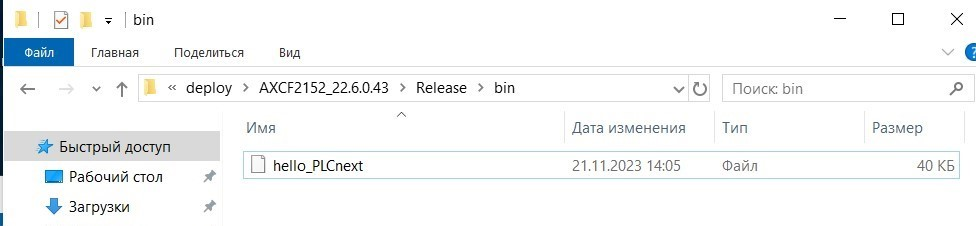
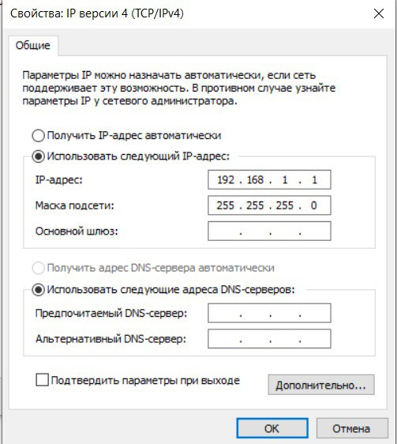
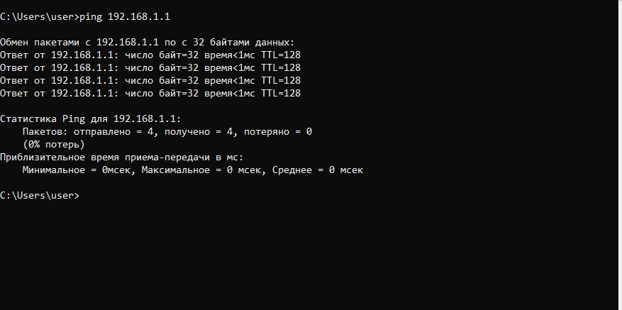
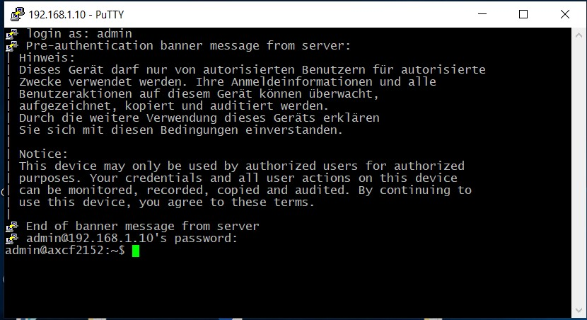
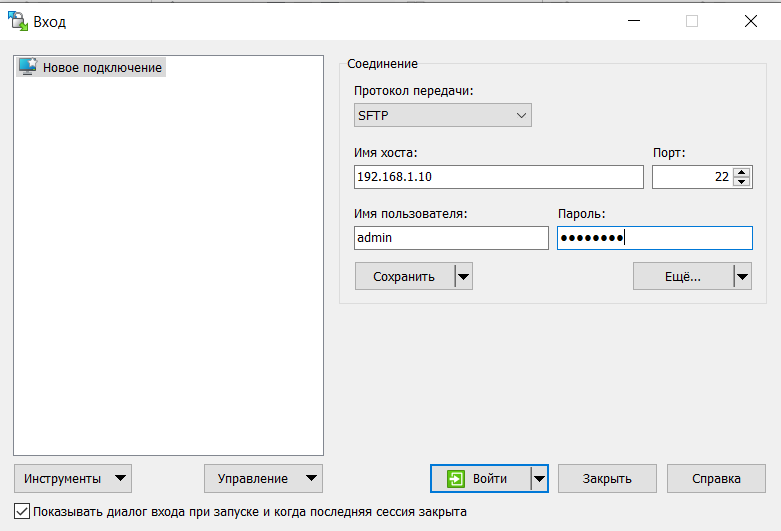
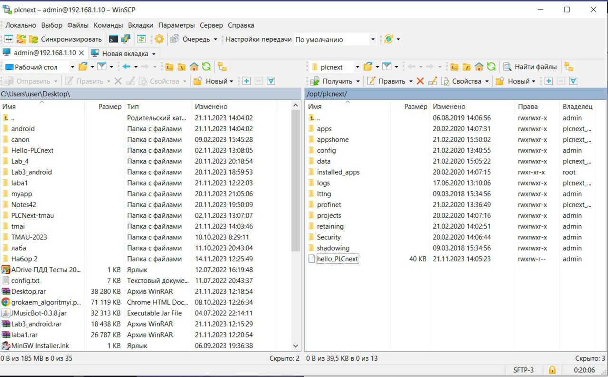
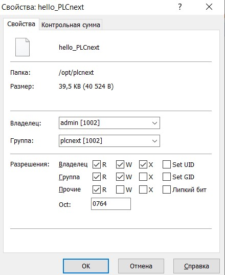
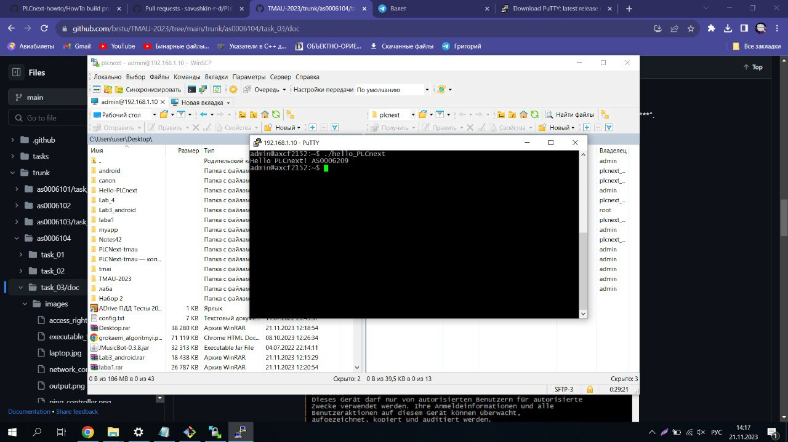
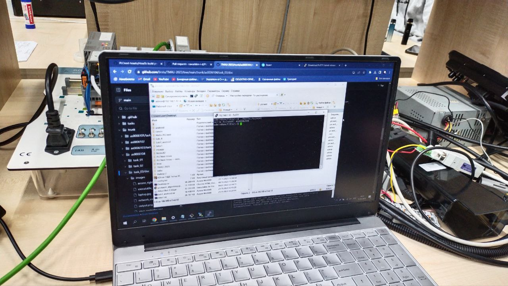

<p align="center"> Министерство образования Республики Беларусь</p>
<p align="center">Учреждение образования</p>
<p align="center">“Брестский Государственный технический университет”</p>
<p align="center">Кафедра ИИТ</p>
<br><br><br>
<p align="center">Лабораторная работа №3</p>
<p align="center">По дисциплине “Теория и методы автоматического управления”</p>
<p align="center">Тема: “Работа с контроллером AXC F 2152”</p>
<br><br><br>
<p align="right">Выполнил:</p>
<p align="right">Студент 3 курса</p>
<p align="right">Группы АС-62</p>
<p align="right">Кравцов Г.С.</p>
<p align="right">Проверил:</p>
<p align="right">Старший преподаватель</p>
<p align="right">Иванюк Д.С.</p>
<br><br><br>
<p align="center">Брест 2023</p>

---
<p> <strong>Цель:</strong> создать тестовый проект "Hello PLCnext from AS0xxyy!", собрать его и продемонстрировать работоспособность на тестовом контроллере.</p> 

Задание: [#3](../../../../tasks/task_03/readme.md).
<p> <strong>Ход работы:</strong> </p>
<p>Клонируем репозиторий.Устанавливаем toolchain, sdk, winSCP, Putty.В склонированном репозитории находим json файл и заменяем в нем версию sdk на 2022.6.0.43 .Собираем проект с помощью следующих команд:</p>

 ``` bash
cmake --preset=build-windows-AXCF2152-2022.6.0.43 .
```


 ``` bash
cmake --build --preset=build-windows-AXCF2152-2022.6.0.43 --target all .
```


 ``` bash
cmake --build --preset=build-windows-AXCF2152-2022.6.0.43 --target install .
```

<p>В результате сборки получаем файл <em></em>hello_PLCnext.</p>

  

<p>Устанавливаем связь с контроллером, перейдя в свойства <em>Ethernet 3</em> и указав IP-адрес и маску подсети:</p>


  

<p>Для проверки соединения выполняем пинг контроллера с использованием команды <em>ping 192.168.1.1</em></p>

  

<p>Запускаем программу <strong>PuTTY Configuration</strong> и устанавливаем соединение с контроллером, введя его IP-адрес.</p>

 

<p>Авторизируемся для подключения к контроллеру. Login: <em>admin</em>; password: <em>можно найти на контроллере</em>.</p>

 

<p>Открываем программу <strong>WinCP</strong>, указываем IP-адрес, логин и пароль для аутентификации</p>

 

<p>Перекидываем бинарный файл <em>hello_PLCnext </em> на контроллер и меняем его свойства, делая его исполняемым</p>

 
 

<p>Запускаем проект и делаем фото.</p>

 

 

<p> <strong> Вывод:</strong> В ходе выполнения лабораторной работы были получены результаты работы с контроллером <strong>AXC F 2152</strong>, а именно вывод <em>AS0006209</em> на экран.</p>
