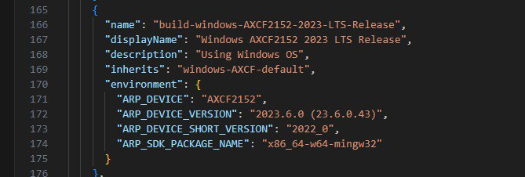
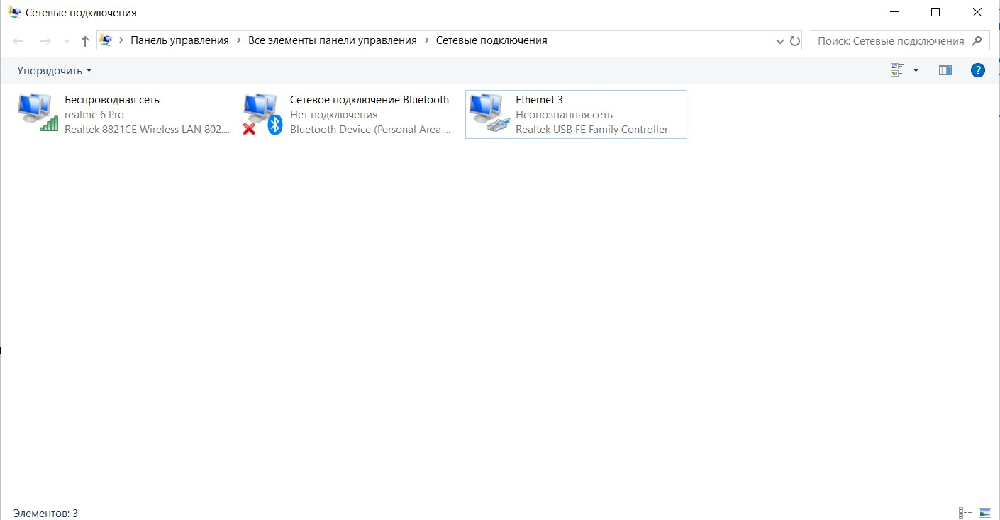
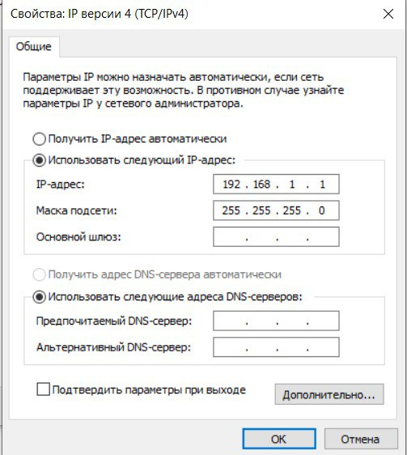
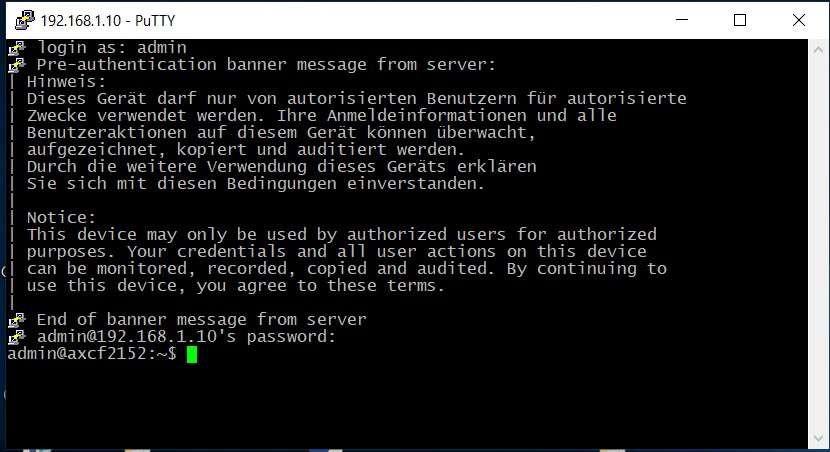

<p align="center"> Министерство образования Республики Беларусь</p>
<p align="center">Учреждение образования</p>
<p align="center">“Брестский Государственный технический университет”</p>
<p align="center">Кафедра ИИТ</p>
<br><br><br>
<p align="center">Лабораторная работа №4</p>
<p align="center">По дисциплине “Теория и методы автоматического управления”</p>
<p align="center">Тема: “Работа с контроллером AXC F 2152”</p>
<br><br><br>
<p align="right"><strong>Выполнил:</strong></p>
<p align="right">Студент 3 курса</p>
<p align="right">Группы АС-62</p>
<p align="right">Кравцов Г.C.</p>
<p align="right"><strong>Проверил:</strong></p>
<p align="right">Старший преподаватель</p>
<p align="right">Иванюк Д.С.</p>
<br><br><br>
<p align="center">Брест 2023</p>

---
<p> <strong> Цель </strong>Собрать проект ptusa_main в <em>Visual Studio</em> и запустить его на котроллере </p>

Задание: [#4] (../../../../tasks/task_04/readme.md) 

<p> <strong> Ход работы: </strong> </p>
<p>Копируем репозиторий проекта используя команду: </p>

 ``` bash
git clone --recurse-submodules https://github.com/savushkin-r-d/ptusa_main.git 
```
<p>Для сборки проекта установим toolchain версии 2023 года и sdk версии 23.6.0.43. sdk необходимо поместить в католог : <em>C:\CLI\SDKs\AXCF2152\2022_0 </em> </p>
<p>Запускаем проект в <em> Visual Studio 2019</em> для дальнейшей сборки. Во время сборки возникли ошибки связанные с версией sdk и отсуствием Python 3 на моем ноутбуке. Если ошибка с Python 3 была легко исправлена посредством его установки, то с sdk было посложнее. Для исправления в файле <em>CmakePresets.josn</em> в ConfigurePresets и BuildPresets была добвлена новая опция сборке на основе необходимой мне версии sdk:</p>



 
<p>Теперь выбираем сборку которую описали ранее:</p>


<p>В результате получаем в каталоге репозитория ptusa_main <em>ptusa_main\bin\build\AXCF2152_2022_0</em> необходимые нам файлы сборки проекта. </p>


<p>Далее подключаемся к контроллеру, открыв свойства в <em>Ethernet 3</em> и введя IP-адрес и маску подсети:.</p>


  

<p>Для проверки подключения пинганем контроллер с помощью команды <em>ping 192.168.1.1</em></p>

  

<p>Открываем программу <strong>PuTTY Configuration</strong> и подключаемся к контроллеру, введя IP-адрес.</p>

 

<p>Авторизируемся для подключения к контроллеру. Login: <em>admin</em>; password: <em>можно найти на контроллере</em></p>

 

<p>Открываем программу <strong>WinCP</strong> вводим IP-адрес, логин и пароль для авторизации</p>

 

<p>Создаем каталог <em>ptusa</em> и помещаем туда файлы необходимые для запуска проекта. Переносим каталог <em>ptusa</em> на контроллер.  </p>


<p>В консоли <em>Putty</em> вводим команду для запуска проекта:</p> 

 ``` bash
./ptusa_main  main.plua  sys_path  ./sys/
```

<p> В результате видим успешный запуск программы, а также ошибки связанные с сетью:</p>


<p> Фотография ноутбука</p>


<p><strong>Вывод:</strong>В ходе работы проект был успешно собран в  <em>Visual Studio 2019</em> и запущен на контроллере в лаборатории. </p>

~~этот текст дабавлен потомучто code duplicate не проходит после каждого нового merge и я надеюсь что этот текст добавит "уникальности" в отчет~~
