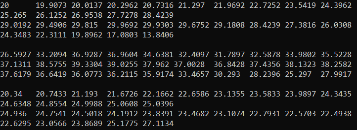

 Министерство образования Республики Беларусь

Учреждение образования

“Брестский Государственный технический университет”

Кафедра ИИТ

   

Практическая работа №1

По дисциплине “Теория и методы автоматического управления”

Тема: “Моделирования температуры объекта”

   

Выполнил:

Студент 3 курса

Группы АС-62

Ляшенко М.В.

Проверил:

Старший преподаватель

Иванюк Д.С.

   

Брест 2023

---

 <strong> Цель: </strong>разработать программу моделирования системы климатконтроля.

 <strong> Задание: </strong> 

1. Основное задание [#1](../../../../tasks/task_01/readme.md).

 <strong> Решение: </strong> 

 

 <strong> Вывод:</strong> в ходе практической работы была разработана программа моделирования системы климатконтроля.
