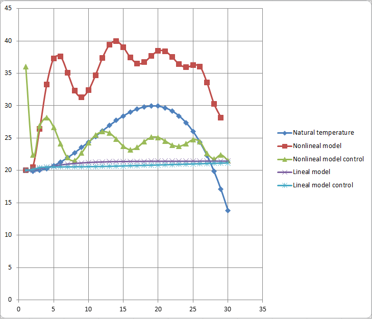

 Министерство образования Республики Беларусь

Учреждение образования

“Брестский Государственный технический университет”

Кафедра ИИТ

   

Практическая работа №3

По дисциплине “Теория и методы автоматического управления”

Тема: “ПИД-регуляторы”

   

Выполнил:

Студент 3 курса

Группы АС-62

Ляшенко М.В.

Проверил:

Старший преподаватель

Иванюк Д.С.

   

Брест 2023

---

 <strong> Цель: </strong>разработать программу моделирования работы ПИД-Регулятора.

 <strong> Задание: </strong> 

1. Основное задание [#2](../../../../tasks/task_02/readme.md).

 <strong> Решение: </strong> 

 Программа разработана согласно парадигмы ООП. Выдержано правило инкапсуляции: внутренние поля классов не доступны для изменения напрямую, код выполнен с разделением на файлы по классам, реализация методов также вынесена отдельно от заголоввочных файлов. При составлении программы было использовано наследование интерфейсного класса. 

  График отображающий результаты работы программы: 

 

 <strong> Вывод:</strong> в ходе практической работы была разработана программа моделирования процесса раюоты ПИД-регулятора.
