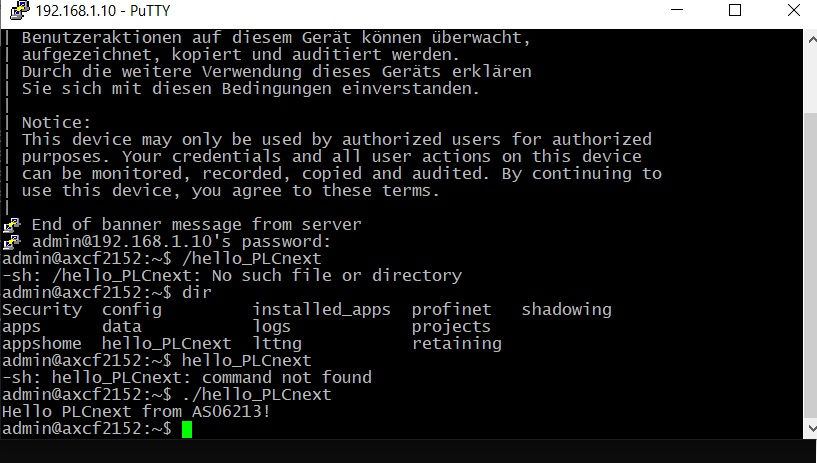

 Министерство образования Республики Беларусь

Учреждение образования

“Брестский Государственный технический университет”

Кафедра ИИТ

   

Практическая работа №3

По дисциплине “Теория и методы автоматического управления”

Тема: “Работа с контроллером AXC F 2152”

   

Выполнил:

Студент 3 курса

Группы АС-62

Ляшенко М.В.

Проверил:

Старший преподаватель

Иванюк Д.С.

   

Брест 2023

---

 <strong> Цель: </strong>Используя Visual Code создать тестовый проект "Hello PLCnext from AS0xxyy!", собрать его и продемонстрировать работоспособность на тестовом контроллере.

 <strong> Задание: </strong> 

1. Основное задание [#3](../../../../tasks/task_03/readme.md).

 <strong> Решение: </strong> 

 В ходе выполнения задания были встречены следующие трудности: 

  - Проблема с установкой plcnext toolchain: дистрибутив программы не видит установленные компоненты. Решение - сменить ПК. 

 

  - Проблема с работой в программе PuTTY: окно программы не полностью отображало интерфейс, обрезая нижнюю часть панели. Возможность изменять размеры окна отсутствует. Решение - с помощью клавиши TAB методом научного тыка нащупать нужную кнопку запуска (2-я по счету после последней видимой кнопки). 

 

  - Проблема с работой в программе PuTTY: неправильно введен IP адрес. Решение - Быть внимательнее (при проверке пинга в консоли при ошибке в IP задержки по времени будут равны нулю. В действительности должны составлять несколько милисекунд) 

 <i>

C:\Users\Я>ping 192.168.1.1

Обмен пакетами с 192.168.1.1 по с 32 байтами данных: 
Ответ от 192.168.1.1: число байт=32 время<1мс TTL=128
Ответ от 192.168.1.1: число байт=32 время<1мс TTL=128
Ответ от 192.168.1.1: число байт=32 время<1мс TTL=128
Ответ от 192.168.1.1: число байт=32 время<1мс TTL=128
Статистика Ping для 192.168.1.1: 

Пакетов: отправлено = 4, получено = 4, потеряно = 0 
    (0% потерь) 
    
Приблизительное время приема-передачи в мс: 
    Минимальное = 0мсек, Максимальное = 0 мсек, Среднее = 0 мсек</i>

  - Результат выполнения работы: 

 

 <strong> Вывод:</strong> в ходе практической работы былли изучены основы работы с контроллером  AXC F 2152.
