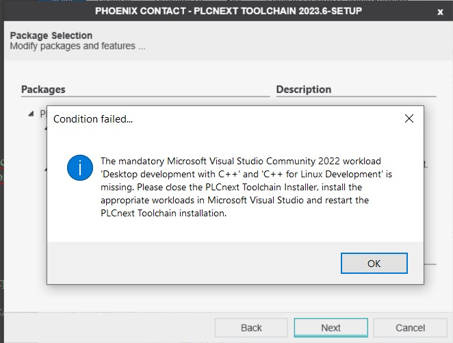
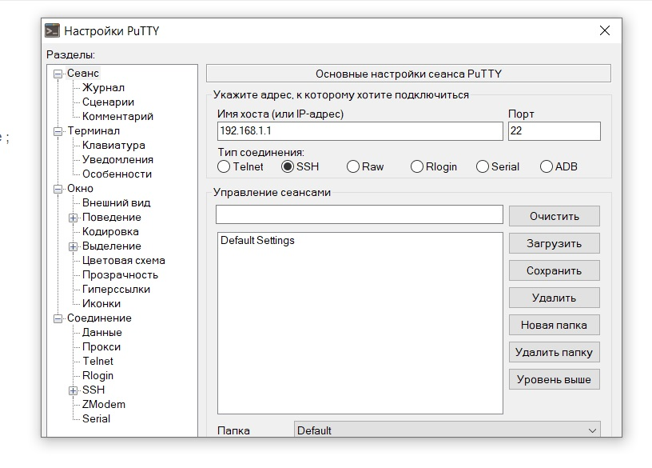
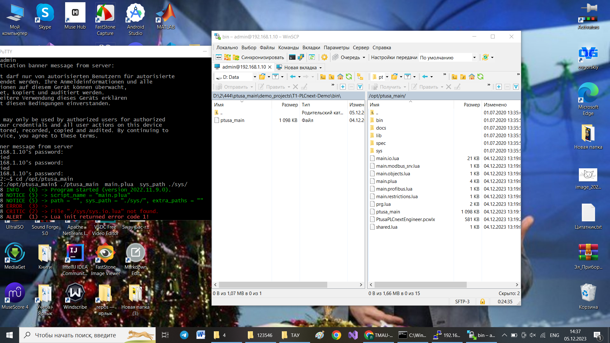
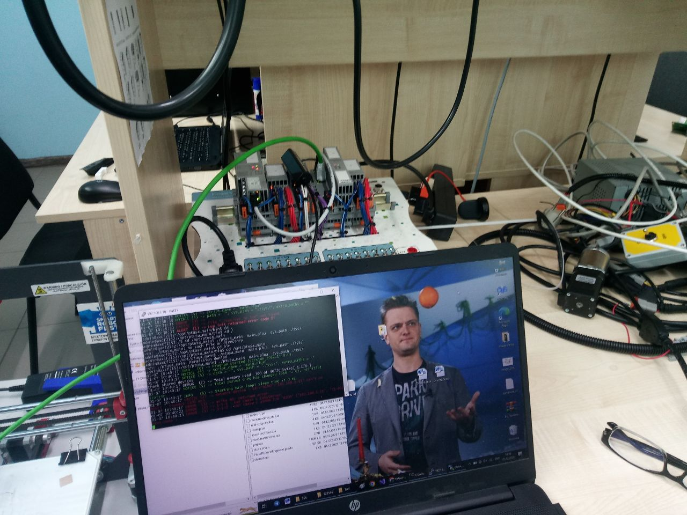

 Министерство образования Республики Беларусь

Учреждение образования

“Брестский Государственный технический университет”

Кафедра ИИТ

   

Практическая работа №4

По дисциплине “Теория и методы автоматического управления”

Тема: “Работа с контроллером AXC F 2152”

   

Выполнил:

Студент 3 курса

Группы АС-62

Ляшенко М.В.

Проверил:

Старший преподаватель

Иванюк Д.С.

   

Брест 2023

---

 <strong> Цель: </strong>Ознакомиться с общей информацией о платформе PLCnext, изучить проект ptusa_main, используя Visual Studio собрать данные проект и продемонстрировать работоспособность на тестовом контроллере.

 <strong> Задание: </strong> 

1. Основное задание [#4](../../../../tasks/task_04/readme.md).

 <strong> Решение: </strong> 

 В ходе выполнения задания были встречены следующие трудности: 

  - Проблема с установкой plcnext toolchain: дистрибутив программы не видит установленные компоненты. Решение - В Visual Studio Installer добавить компонент совместимости C++ с Linux

 

  - Проблема с работой в программе PuTTY: окно программы не полностью отображало интерфейс, обрезая нижнюю часть панели. Возможность изменять размеры окна отсутствует. Решение - В английской версии пронраммы такой неполадки нет. 

 

  - Проблема с работой в программе PuTTY: неправильно введен IP адрес. Решение - Быть внимательнее (при проверке пинга в консоли при ошибке в IP задержки по времени будут равны нулю. В действительности должны составлять несколько милисекунд) 

 <i>C:\Users\Я>ping 192.168.1.1
Обмен пакетами с 192.168.1.1 по с 32 байтами данных: 
Ответ от 192.168.1.1: число байт=32 время<1мс TTL=128
Ответ от 192.168.1.1: число байт=32 время<1мс TTL=128
Ответ от 192.168.1.1: число байт=32 время<1мс TTL=128
Ответ от 192.168.1.1: число байт=32 время<1мс TTL=128
Статистика Ping для 192.168.1.1: 
Пакетов: отправлено = 4, получено = 4, потеряно = 0 
    (0% потерь) 
Приблизительное время приема-передачи в мс: 
    Минимальное = 0мсек, Максимальное = 0 мсек, Среднее = 0 мсек</i>

    

  - Проблема с запуском исполнительного файла: Программа не видит библиотеки. Решение - Перенести исполнительный файл зи папки bin в родительский каталог или изменить путь к библиотекам в аргументах команды запуска

    

<i>admin@axcf2152:/opt/ptusa_main/bin$ ./ptusa_main  main.plua  sys_path sys/
01-07 10:38:23 INFO   (6) -> Program started (version 2022.11.9.0).
01-07 10:38:23 NOTICE (5) -> script_name = "main.plua"
01-07 10:38:23 NOTICE (5) -> path = "", sys_path = "sys/", extra_paths = ""
01-07 10:38:23 ERROR  (3) ->
01-07 10:38:23 CRITIC (2) -> File "sys/sys.io.lua" not found.
01-07 10:38:23 ALERT  (1) -> Lua init returned error code 1!
admin@axcf2152:/opt/ptusa_main/bin$ ./ptusa_main  main.plua  sys_path ./sys/
01-07 10:38:33 INFO   (6) -> Program started (version 2022.11.9.0).
01-07 10:38:33 NOTICE (5) -> script_name = "main.plua"
01-07 10:38:33 NOTICE (5) -> path = "", sys_path = "./sys/", extra_paths = ""
01-07 10:38:33 ERROR  (3) ->
01-07 10:38:33 CRITIC (2) -> File "./sys/sys.io.lua" not found.
01-07 10:38:33 ALERT  (1) -> Lua init returned error code 1!

    

  - Результат: программа запускается, начинает искать подключенное устройство по соседнему IP 192.168.1.11, не находит,и завершает свою работу.

    

<i>admin@axcf2152:/opt/ptusa_main$ ./ptusa_main  main.plua  sys_path ./sys/
01-07 10:40:17 INFO   (6) -> Program started (version 2022.11.9.0).
01-07 10:40:17 NOTICE (5) -> script_name = "main.plua"
01-07 10:40:17 NOTICE (5) -> path = "", sys_path = "./sys/", extra_paths = ""
Check shared devices
01-07 10:40:17 DEBUG  (7) -> Total memory used: 360 of 30720 bytes[ 1.17% ].
01-07 10:40:17 NOTICE (5) -> Total params size has changed (360 != 0), reinitial          ization.
01-07 10:40:17 INFO   (6) -> Starting main loop! Sleep time is 0 ms.
01-07 10:40:17 CRITIC (2) -> Network device : s4->"A100":"192.168.1.11" can't co          nnect : timeout (100 ms).
01-07 10:40:17 ERROR  (3) -> Write AO: returned error
01-07 10:40:22 ERROR  (3) -> 1-5-5 : Нет связи с EasyServer.
01-07 10:40:23 ERROR  (3) -> 1-1-2 : Нет связи с узлом I/O 'A100' ('192.168.1.11', 'T1-PLCnext-Demo')

  - Результат выполнения работы: 

 

 

 <strong> Вывод:</strong> в ходе практической работы былли изучены основы работы с контроллером  AXC F 2152.
